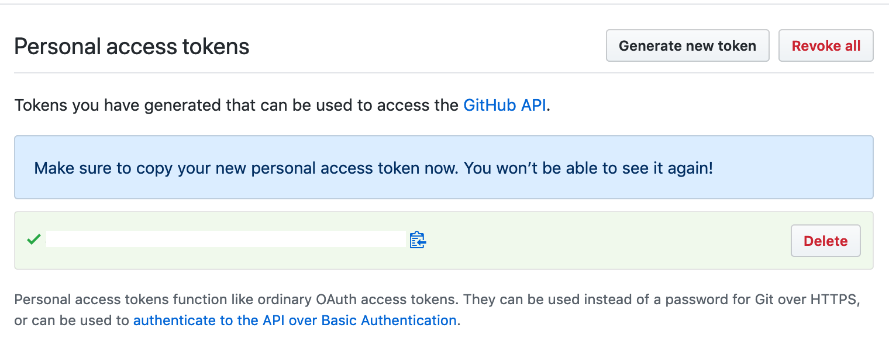

# Your first R package with unit tests

## Learning Objectives

* Create an R package
* Create a function
* Document the function
* Include error checking in the function
* Write unit tests for the function
* Use your package in a script
* Share your package through GitHub

## Resources

* [R Packages](http://r-pkgs.had.co.nz/) by Hadley Wickham
* [usethis](https://usethis.r-lib.org/) by Jenny Bryan

## Setting Up

You will need to install the following packages:

```{r install, eval = FALSE}
install.packages(c("devtools", "roxygen2", "testthat", "usethis", "knitr"))
```


## Create your R package

Use the following command to create the framework for a new package called `demopckg`. Set the argment to the path where you want to save your package. The last section of the path should be the name of the package.

```{r create-package, eval = FALSE}
usethis::create_package("~/rstuff/demopckg")
```

```{block type="warning"}
Package names can only be letters, numbers, and full stops.
```

You'll see the following output, and a new RStudio project will open up. You can close the old window now and just work in this project.

```
✔ Setting active project to '~/rstuff/demopckg'
✔ Creating 'R/'
✔ Creating 'man/'
✔ Writing 'DESCRIPTION'
✔ Writing 'NAMESPACE'
✔ Writing 'demopckg.Rproj'
✔ Adding '.Rproj.user' to '.gitignore'
✔ Adding '^demopckg\\.Rproj$', '^\\.Rproj\\.user$' to '.Rbuildignore'
✔ Opening new project 'demopckg' in RStudio
```

### Edit the DESCRIPTION file

Open the `DESCRIPTION` file. It should look like this:

```
Package: demopckg
Title: What the Package Does (One Line, Title Case)
Version: 0.0.0.9000
Authors@R: 
    person(given = "First",
           family = "Last",
           role = c("aut", "cre"),
           email = "first.last@example.com")
Description: What the package does (one paragraph).
License: What license it uses
Encoding: UTF-8
LazyData: true
```

Change the title, authors, and description to your own information.


### Create a LICENSE

Add a license using one of the following options:

```{r license, eval = FALSE}
usethis::use_mit_license(name = "YOUR NAME")  # permissive sharing
usethis::use_cc0_license(name = "YOUR NAME")  # public domain - use for data packages
usethis::use_gpl3_license(name = "YOUR NAME") # derivatives must be open
```

### Create a README

Use the following code to set up a README document that will explain your package.

```{r readme, eval = FALSE}
usethis::use_readme_rmd() 
```

We'll eventually put this on github, so change the installation instructions to the following (change `yourusername` to your github username). Delete the example for now.
```
You can install the released version of demopckg from [GitHub](https://github.com) with:

&#96;&#96;&#96; r
devtools::install_github("yourusername/demopckg")
&#96;&#96;&#96;
```

## Creating a function

Create a new R script from the File menu (**`New File`** > **`R Script`**).

Paste the following template into your file:

```{r template-function, eval = FALSE}
#' My function
#'
#' `myfunction` does something.
#'
#' @param arg1 The first argument
#' @return \code{arg1}
#' @examples
#'
#' myfunction(1) # returns 1
#' 
#' @export

myfunction <- function(arg1) { arg1 }
```

We're going to create a function that reports a p-value in APA style, named `report_p`. It will take two arguments, the p-value (`p`) and the number of digits to round to (`digits`). 

```{block, type="try"}
Replace `myfunction` with `report_p` and change the arguments. Should `p` have a default value? Should `digits`?
```

The first thing we should do in the function is check whether `p` is less than 0.001, and if it is, return the value "p < .001".

```{r p1, eval = FALSE}
report_p <- function(p, digits = 3) {
  if (p < .001) return("p < .001")
}
```

```{block, type="info"}
Once you run the `return()` function, your function stops running.
```

If `p` is greater than 0.001, then we should round it to the specified number of `digits`, paste it after the string "p = ", and return it.

```{r p2, eval = FALSE}
report_p <- function(p, digits = 3) {
  if (p < .001) return("p < .001")
  
  round_p <- round(p, digits)
  p_string <- paste("p =", p_round)
  
  return(p_string)
}
```

```{block, type="try"}
Run your function and test it with a few different p-values and digits. Try `report_p(0.01034)`. Does this look exactly like you expect?
```

APA style omits the leading zero and pads the number out to three digits. We can do this by converting our rounded p-value into a character string, replacing the string "0." with ".", and making sure to pad the right side with enough zeros. The `stringr` package has useful functions for this.

```{r p3, eval = FALSE}
report_p <- function(p, digits = 3) {
  if (p < .001) return("p < .001")

  p_round <- round(p, digits) %>%
    as.character() %>%
    # omit leading zero for APA-style
    stringr::str_replace("0.", ".") %>%
    # pad right with zeros
    stringr::str_pad(digits+1, "right", 0)

  p_string <- paste("p =", p_round)
  
  return(p_string)
}
```

### Documentation

Now edit the commented part before your function. The `#'` is special to `roxygen2` documentation, which we'll enable below. This generates what you see in the Help viewer. Type `?mean` into the console pane and have a look at the Help pane.

* The first line is the name of the function in title case
* The Description is the lines between the title and first `@param`
* The Useage is automatically generated
* The Arguments section is generated from the list of `@param`argument Argument description...
* The Value section is the text after `@return`
* The Examples section is the text under `@examples`
* This block should end with `@export` to make sure your function is added to your package

```{block, type="try"}
Edit the documentation for your `report_p` function.
```

Save your file in the `R` directory with the name `report_p.R`. For now, we'll make a separate file for each function and give it the name of the function.

Roxygen creates automatic documentation. You enable it with the following command (you only need to run this once per package).

```{r roxygen, eval = FALSE}
usethis::use_roxygen_md()
```

Now you can automatically update the documentation for your package by running `devtools::document()`, after which you should see the following text.

```
Updating demopckg documentation
Writing NAMESPACE
Loading demopckg
Writing report_p.Rd
```

You don't need to worry about these files, they'll be added to your package to show Help documentation.

### Imports

You need to "import" any packages you used in your function by running `usethis::use_package` for each package you want to include. 

```{r imports, eval = FALSE}
usethis::use_package("stringr")
```

```{block, type="warning"}
You can't import the whole `tidyverse`, but you can import each package separately. Import just the packages you actually need.

tidyverse = ggplot2, purrr, tibble, dplyr, tidyr, stringr, readr, forcats
```

```{block, type="info"}

If you use pipes (even if you've imported `dplyr`), you also need to run `usethis::use_pipe()`. It will add a file called `utils-pipe.R` to your `R` directory and add `magrittr` to your Imports.
```

## Build your package

Now you're ready to check and build your package for installation.

### Check

First, check everything by running `devtools::check()`. You'll get a lot of output, but don't worry unless you have an error message. Hopefully, you'll get this message:

```
0 errors ✔ | 0 warnings ✔ | 0 notes ✔
```
### Build

Next, run `devtools::build()`. You'll get a message that looks like this:

```
✔  checking for file ‘/Users/lisad/rproj/demopckg/DESCRIPTION’ ...
─  preparing ‘demopckg’:
✔  checking DESCRIPTION meta-information ...
─  checking for LF line-endings in source and make files and shell scripts
─  checking for empty or unneeded directories
─  building ‘demopckg_0.0.0.9000.tar.gz’
   
[1] "/Users/lisad/rproj/demopckg_0.0.0.9000.tar.gz"
```
### Install

Next, install your new package with the following code (`../`  means to go up one directory to look for the `demopckg` install file).

```{r install-package, eval = FALSE}
devtools::install("../demopckg")
```

You'll see a bunch of output that should end in:

```
* DONE (demopckg)
```

### Test

To make sure it's all gone well, restart R and try to use the function `report_p(0.00039)`. You should get an error message.

Then load your new package with `library(demopckg)` are retry the example above.

Type `?report_p` in the console and look at your Help documentation.

```{block, type="try"}
Restart R and open a new .R or .Rmd file. Load your new package at the top of the file and try using your function in a paragraph that reports the p-value for a test.
```

## Error checking

Try running your function with different values for `p`. What happens if you use invalid values, like 1.07, -0.05, or "A"?

We can add error checking to a function to quit and give a message if the error is fatal, or just warn them if the error is recoverable, but probably wrong.

P-values can't ever be less than 0 or greater than 1, so we can just quit and give an error message if that happens. Add the following code to the beginning of your function, rerun the code to update the function, and test it on some values of p that are less than 0 or greater than 1.

```{r error-check, eval = FALSE}
  if (p < 0) stop("p cannot be less than 0")
  if (p > 1) stop("p cannot be greater than 1")
```

What other errors do you think people might make? You can add checks to the beginning of your function to warn people if they don't enter reasonable numbers for the digits argument and set digits to the default value so that the code can continue.

```{r warning-example, eval = FALSE}
  if (!(digits %in% 1:5)) {
    warning("digits should probably be an integer between 1 and 5")
    digits = 3
  }
```

## Unit tests

Up until now, we've just tested our function in an ad hoc way every time we made changes. We can make this process more formal by using unit tests. These will make sure that your function is working properly if you make any changes. This seems like overkill for simple functions, but is absolutely essential for big projects, so best to get into good habits now.

### Setup

When you set up a new package, you need to set up the testing structure using `usethis::use_testthat()`. You only need to do this once for each package and you will know it has been done if a new directory called `tests` is made.

### New unit tests

Create a new .R file and save it as `test-report_p.R` in the `/tests/testthat/` directory. Copy the following text into the file:

```{r testthat-stub, eval = FALSE}
context("report_p")

testthat::test_that("errors", {
  testthat::expect_error(
    report_p(-1),
    "p cannot be less than 0"
  )
  
  testthat::expect_error(
    report_p(2),
    "p cannot be greater than 1"
  )
})
```

The `context` function lets you know what function you're testing when you run all the unit tests in a package. The `test_that` function checks a groups of expectataions. The first set we're going to make checks if we get the error messages we expect, so we've called it "errors".

We're going to check two expectations, that we'll get the error message "p cannot be less than 0" if p = -1, and that we'll get the error message "p cannot be greater than 1" id p = 2. You can test more values than these, but we'll start with just these two.

After you save this file, run `devtools::test()`. You should see output like:

```
Loading demopckg
Testing demopckg
✔ | OK F W S | Context
✔ |  2       | report_p

══ Results ═══════════════════════════════════════════════════════════
OK:       2
Failed:   0
Warnings: 0
Skipped:  0
```

Now add another `testthat::test_that` block called "default values". Use the function `testthat::expect_equal` to check if the output of the `report_p()` function with different `p` values and the default `digits` value gives you the expected output. For example:

```{r expect_equal, eval = FALSE}
  testthat::expect_equal(
    report_p(p = 0.0222),
    "p = .022"
  )
```

### Run all tests

Run `devtools::test()` after you add each test to make sure your tests work as expected.

## Share your package

You can do package development without a [GitHub](https://github.com) account, but this is one of the easiest ways to share your package.

### Set up git for this project

If you aren't already using version control for this project, make sure all of your files are saved and type `usethis::use_git()` into the console. Choose Yes to commit and Yes to restart R.

### GitHub access token

Now set up a github access token with `usethis::browse_github_pat()`. Your web browser will open and you'll be asked to log into your github account and then asked to authorise a new token. Accept the defaults and click OK at the bottom of the page.

```{r, echo = FALSE, fig.cap="Authorise a github token so you can create new github repositories from RStudio"}
knitr::include_graphics("images/github_new_token.png")
```

Copy your token (the blacked-out bit in the image below).

```{r, echo = FALSE, fig.cap="Copy your github token"}

```

Type `usethis::edit_r_environ()` in the RStudio console pane. A new file called `.Renviron` will appear in the source pane. Add the following line to it (replace **`<YOUR-TOKEN>`** with your copied token).

```
GITHUB_PAT=<YOUR-TOKEN>
```

Save and close the file, then restart R.

### Make a new GitHub repository

Type `usethis::use_github(protocol="https")` into the console window and check that the suggested title and description are OK.

```
✔ Setting active project to '/Users/lisad/rproj/demopckg'
● Check title and description
  Name:        demopckg
  Description: Demo Stuff
Are title and description ok?
1: No way
2: Yeah
3: No
```

If you choose **`Yeah`**, you'll see some messages and your web browser will open the github repsitory page.

```{r, echo = FALSE, fig.cap="Your new github repository"}
knitr::include_graphics("images/github_demoproj.png")
```

### Install your package from GitHub

Install your package using the following code (replacing `debruine` with your github username).

```{r github-install, eval = FALSE}
devtools::install_github("debruine/demopckg")
```

## The full `report_p` function

Here's what the full function should look like.

```{r report-p}
#' Report p-value
#'
#' `report_p` reports a p-value.
#'
#' @param p The p-value
#' @param digits The number of digits to round to (default = 3)
#'
#' @return A string with the format "p = .040" or "p < .001"
#' @examples
#'
#' report_p(0.02018) # returns "p = .020"
#' report_p(0.00028) # returns "p < .001"
#'
#' @export

report_p <- function(p, digits = 3) {
  if (p < 0) stop("p cannot be less than 0")
  if (p > 1) stop("p cannot be greater than 1")
  if (digits < 1) {
    warning("digits should probably be an integer between 1 and 5")
    digits = 3
  }
  
  if (p < .001) return("p < .001")

  p_round <- round(p, digits) %>%
    as.character() %>%
    # omit leading zero for APA-style
    stringr::str_replace("0.", ".") %>%
    # pad right with zeros
    stringr::str_pad(digits+1, "right", 0)

  p_string <- paste("p =", p_round)
  
  return(p_string)
}
```
