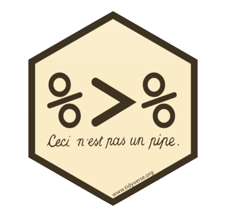

# Pipes



Pipes are a way to order your code in a more readable format. 

Let's say you have a small data table with 10 participant IDs, two columns with variable type A, and 2 columns with variable type B. You want to calculate the mean of the A variables and the mean of the B variables and return a table with 10 rows (1 for each participant) and 3 columns (`id`, `A_mean` and `B_mean`). 

One way you could do this is by creating a new object at every step and using that object in the next step. This is pretty clear, but you've created 6 unnecessary data objects in your environment. This can get confusing in very long scripts. 

```{r no-pipe-example, message=FALSE}
library(tidyverse)

# make a data table with 10 subjects
data_original <- tibble(
  id = 1:10,
  A1 = rnorm(10, 0),
  A2 = rnorm(10, 1),
  B1 = rnorm(10, 2),
  B2 = rnorm(10, 3)
)

# gather columns A1 to B2 into "variable" and "value" columns
data_gathered <- gather(data_original, variable, value, A1:B2)

# separate the variable column at the _ into "var" and "var_n" columns
data_separated <- separate(data_gathered, variable, c("var", "var_n"), sep = 1)

# group the data by id and var
data_grouped <- group_by(data_separated, id, var)

# calculate the mean value for each id/var 
data_summarised <- summarise(data_grouped, mean = mean(value))

# spread the mean column into A and B columns
data_spread <- spread(data_summarised, var, mean)

# rename A and B to A_mean and B_mean
data <- rename(data_spread, A_mean = A, B_mean = B)
```

`r knitr::kable(data)`

<p class="warning">You *can* name each object `data` and keep replacing the old data object with the new one at each step. This will keep you environment clean, but I don't recommend it because it makes it too easy to accidentally run your code out of order when you are running line-by-line for development or debugging.</p>

One way to avoid extra objects is to nest your functions, literally replacing each data object with the code that generated it in the previous step. This can be fine for very short chains.

```{r ok-chain}
mean_petal_width <- round(mean(iris$Petal.Width), 2)
```
But it gets extremely confusing for long chains:

```{r no-pipe-example-very-bad}
# do not ever do this!!
data <- rename(
  spread(
    summarise(
      group_by(
        separate(
          gather(
            tibble(
              id = 1:10,
              A1 = rnorm(10, 0),
              A2 = rnorm(10, 1),
              B1 = rnorm(10, 2),
              B2 = rnorm(10, 3)), 
            variable, value, A1:B2), 
          variable, c("var", "var_n"), sep = 1), 
        id, var), 
      mean = mean(value)), 
    var, mean), 
  A_mean = A, B_mean = B)

```

The pipe lets you "pipe" the result of each function into the next function, allowing you to put your code in a logical order without creating too many extra objects.

```{r pipe-example}
# calculate mean of A and B variables for each participant
data <- tibble(
  id = 1:10,
  A1 = rnorm(10, 0),
  A2 = rnorm(10, 1),
  B1 = rnorm(10, 2),
  B2 = rnorm(10, 3)
) %>%
  gather(variable, value, A1:B2) %>%
  separate(variable, c("var", "var_n"), sep=1) %>%
  group_by(id, var) %>%
  summarise(mean = mean(value)) %>%
  spread(var, mean) %>%
  rename(A_mean = A, B_mean = B)
  
```

You can read this code from top to bottom as follows:

1. Make a tibble called `data` with
    - `id` of 1 to 10,
    - `A1` of 10 random numbers from a normal distribution with a mean of 0,
    - `A2` of 10 random numbers from a normal distribution with a mean of 1,
    - `B1` of 10 random numbers from a normal distribution with a mean of 2, 
    - `B2` of 10 random numbers from a normal distribution with a mean of 3; and then
2. Gather to create `variable` and `value` column from columns `A_1` to `B_2`; and then
3. Separate the column `variable` into 2 new columns called `var`and `var_n`, separate at character 1; and then
4. Group by columns `id` and `var`; and then
5. Summarise and new column called `mean` as the mean of the `value` column for each group; and then
6. Spread to make new columns with the key names in `var` and values in `mean`; and then
7. Rename to make columns called `A_mean` (old `A`) and `B_mean` (old `B`)

You can make intermediate objects whenever you need to break up your code because it's getting too complicated or you need to debug something.

<p class="info">You can debug a pipe by running just the first few functions by highlighting from the beginning to just before the pipe you want to stop at. Try this by highlighting from `data <-` to the end of the `separate` function and typing cmd-return. What does `data` look like now?</p>