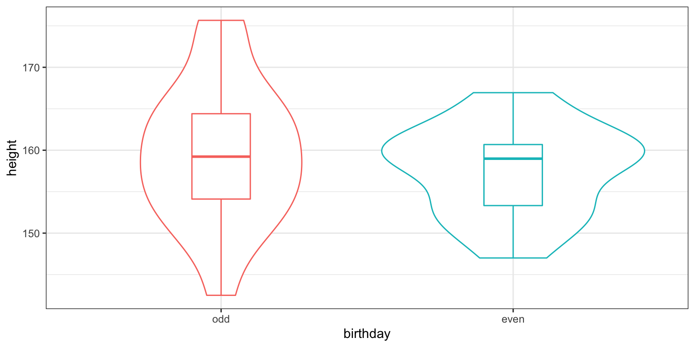
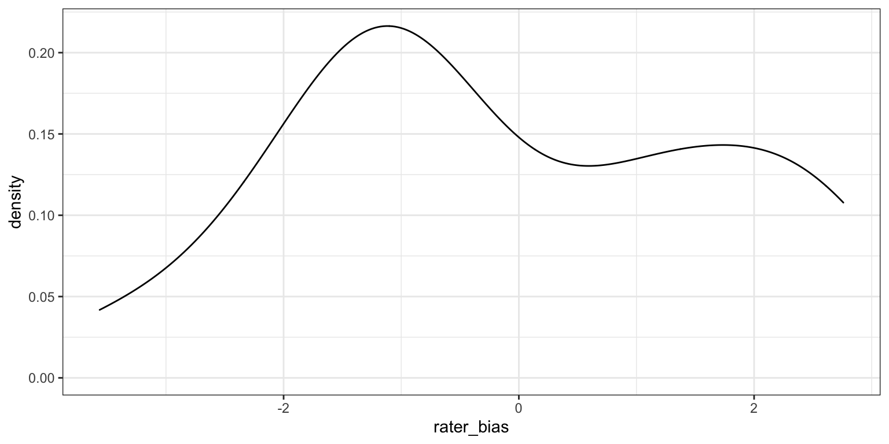
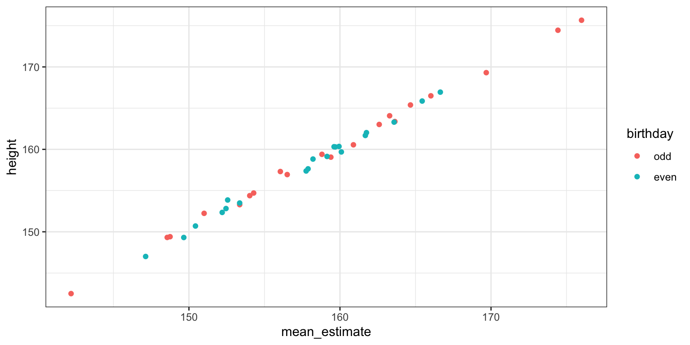

# What's wrong with aggregating data? {#aggregate}


```r
library(tidyverse)
library(lmerTest)
library(faux) #devtools::install_github("debruine/faux")
set.seed(90210)
```

Imagine you want to find out if Armenian women born on an even-numbered day are taller than women born on an odd-numbered day. (I've chosen Armenian women because they're the first row in [this paper](https://doi.org/10.1371/journal.pone.0018962).) 

First, let's simulate a group of 20 women born on even-numbered days and 20 women born on odd-numbered days.


```r
stim_n <- 20
# height stats from https://journals.plos.org/plosone/article?id=10.1371/journal.pone.0018962
height_m <- 158.1
height_sd <- 5.7

stim <- tibble(
  stim_id = 1:(stim_n*2),
  birthday = rep(c("odd", "even"), stim_n),
  height = rnorm(stim_n*2, height_m, height_sd)
)
```

You can alternatively simulate this using a function from the [faux](https://debruine.github.io/faux/) package I'm developing.


```r
stim <- sim_design(between = list(birthday = c("odd", "even")),
                   n = stim_n, mu = height_m, sd = height_sd, 
                   id = "stim_id", dv = "height", seed = 90210, plot = FALSE)
```

```
## Warning in sim_design(between = list(birthday = c("odd", "even")), n = stim_n, :
## The seed argument is deprecated. Please set seed using set.seed() instead
```


```
## `summarise()` ungrouping output (override with `.groups` argument)
```

<div class="figure" style="text-align: center">

<p class="caption">(\#fig:unnamed-chunk-3)**CAPTION THIS FIGURE!!**</p>
</div>

Obviously, the oddness of date of birth is not going to have any effect on women's actual height and a two-sample t-test confirms this. However, there is a small difference between the means of the groups just due to chance (1.89 cm).


```r
t.test(stim$height ~ stim$birthday)
```

```
## 
## 	Welch Two Sample t-test
## 
## data:  stim$height by stim$birthday
## t = 0.84149, df = 32.455, p-value = 0.4062
## alternative hypothesis: true difference in means is not equal to 0
## 95 percent confidence interval:
##  -2.688091  6.476042
## sample estimates:
##  mean in group odd mean in group even 
##           159.5433           157.6493
```

### Measurement with Error

But what if we don't measure height from each women once, but have a few different raters estimate it? The raters will each have their own bias, systematically overestimating or underestimating height on average. Let's simulate 20 raters who have biases with an SD of 2 cm. 


```r
rater_n <- 20
rater_bias_sd <- 2

rater <- tibble(
  rater_id = 1:rater_n,
  rater_bias = rnorm(rater_n, 0, rater_bias_sd)
)
```

Again, you can also set up the simulated raters using faux's `sim_design()` function.


```r
rater <- sim_design(n = rater_n, sd = rater_bias_sd, 
                    dv = "rater_bias", id = "rater_id", 
                    seed = 101, plot = FALSE)
```


<div class="figure" style="text-align: center">

<p class="caption">(\#fig:unnamed-chunk-7)**CAPTION THIS FIGURE!!**</p>
</div>

New we can get each rater to estimate the height of each woman. Their estimate is the woman's actual height, plus the rater's bias, plus some error (sampled from a normal distribution with a mean of 0 and an SD of 4 cm, since estimating height is hard).


```r
dat <- expand.grid(
  rater_id = rater$rater_id,
  stim_id = stim$stim_id
) %>%
  left_join(rater, by = "rater_id") %>%
  left_join(stim, by = "stim_id") %>%
  mutate(
    error = rnorm(nrow(.), 0, 4),
    estimate = height + rater_bias + error
  )
```


### Aggregating by stimuli

You can aggregate by stimuli, that is, average the 20 raters' estimate for each stimulus. You now have 40 mean estimates that are fairly well-correlated with the women's actual heights.


```r
dat_agg_by_stim <- dat %>%
  group_by(stim_id, birthday, height) %>%
  summarise(mean_estimate = mean(estimate))
```

```
## `summarise()` regrouping output by 'stim_id', 'birthday' (override with `.groups` argument)
```

<div class="figure" style="text-align: center">

<p class="caption">(\#fig:unnamed-chunk-10)**CAPTION THIS FIGURE!!**</p>
</div>

You get pretty much the same result when you compare these mean estimates between the groups of women with odd and even birthdays.


```r
t.test(dat_agg_by_stim$mean_estimate ~ dat_agg_by_stim$birthday)
```

```
## 
## 	Welch Two Sample t-test
## 
## data:  dat_agg_by_stim$mean_estimate by dat_agg_by_stim$birthday
## t = 0.76274, df = 31.863, p-value = 0.4512
## alternative hypothesis: true difference in means is not equal to 0
## 95 percent confidence interval:
##  -2.917085  6.408535
## sample estimates:
##  mean in group odd mean in group even 
##           159.2072           157.4615
```

### Aggregating by raters

Alternatively, you can aggregate by raters, that is, average the 20 odd-group estimates and 20 even-group estimates for each rater. Now raters are your unit of analysis, so you've increased your power by having 20 raters and a within-subject design (each rater estimates heights for both odd- and even-birthday groups).


```r
dat_agg_by_rater <- dat %>%
  group_by(rater_id, birthday) %>%
  summarise(mean_estimate = mean(estimate)) %>%
  spread(birthday, mean_estimate)
```

```
## `summarise()` regrouping output by 'rater_id' (override with `.groups` argument)
```

```r
t.test(dat_agg_by_rater$odd, dat_agg_by_rater$even, paired = TRUE)
```

```
## 
## 	Paired t-test
## 
## data:  dat_agg_by_rater$odd and dat_agg_by_rater$even
## t = 11.664, df = 19, p-value = 4.179e-10
## alternative hypothesis: true difference in means is not equal to 0
## 95 percent confidence interval:
##  1.432469 2.058980
## sample estimates:
## mean of the differences 
##                1.745725
```

Now the difference between the odd- and even-birthday groups is highly significant! What's going is that you now have a relatively accurate estimate of the difference between the 20 women in the odd-birthday group and the 20 women in the even-birthday group. Since raters are the unit of analysis, this effect is likely to generalise to the larger population of potential raters, but only when they are rating **these exact stimuli**. Your conclusions cannot generalise beyond the stimulus set used here.

While this seems like an obvious problem when the question is whether Armenian women with odd birthdays are taller or shorter than Armenian women with even birthdays, the problem is not so obvious for other questions, like whether boxers who won their last match have more masculine faces than boxers who lost their last match. The point of this tutorial isn't to call out any particular studies (I've certainly done this wrong myself plenty of times in the past), but to illustrate the enormous problem with this method and to explain the solution.


### Mixed Effect Model

In the particular case above, we're only interested in the between-stimulus main effect of birthday oddness. Therefore, aggregating by stimuli doesn't inflate your false positive rate, while aggregating by rater does. However, other designs might have increased false positives for aggregating by stimuli but not by rater, or when aggregating by either. 

A mixed effects model avoids the problems of aggregation completely by modelling random variation for both the stimuli and raters, as well as random variation in the size of within-group effects. You can generalise the conclusions of a mixed effects model to both the population of raters and the population of stimuli. (I [effect code](https://debruine.github.io/posts/coding-schemes/) the `birthday` variable to make interpretation of the effects easier).


```r
# effect-code birthday
dat$birthday.e <- recode(dat$birthday, "odd" = 0.5, "even" = -0.5)

mod <- lmer(estimate ~ birthday.e +
              # random slope for effect of birthday, random intercept for rater bias
              (1 + birthday.e | rater_id) + 
              # random intercept for variation in stim height
              (1 | stim_id), 
            data = dat)

summary(mod)
```

```
## Linear mixed model fit by REML. t-tests use Satterthwaite's method [
## lmerModLmerTest]
## Formula: estimate ~ birthday.e + (1 + birthday.e | rater_id) + (1 | stim_id)
##    Data: dat
## 
## REML criterion at convergence: 18223.8
## 
## Scaled residuals: 
##     Min      1Q  Median      3Q     Max 
## -3.3799 -0.6699 -0.0107  0.6512  3.3528 
## 
## Random effects:
##  Groups   Name        Variance Std.Dev. Corr
##  stim_id  (Intercept) 52.18699 7.2241       
##  rater_id (Intercept)  2.84478 1.6866       
##           birthday.e   0.04953 0.2226   0.13
##  Residual             15.94272 3.9928       
## Number of obs: 3200, groups:  stim_id, 40; rater_id, 20
## 
## Fixed effects:
##             Estimate Std. Error      df t value Pr(>|t|)    
## (Intercept)  158.334      1.205  45.548 131.404   <2e-16 ***
## birthday.e     1.746      2.289  38.032   0.763     0.45    
## ---
## Signif. codes:  0 '***' 0.001 '**' 0.01 '*' 0.05 '.' 0.1 ' ' 1
## 
## Correlation of Fixed Effects:
##            (Intr)
## birthday.e 0.001
```


The estimate for `(Intercept)` is just the mean height estimate (158.33 cm) and the estimate for `birthday.e` is the mean difference between the odd and even birthday groups (1.75 cm).
