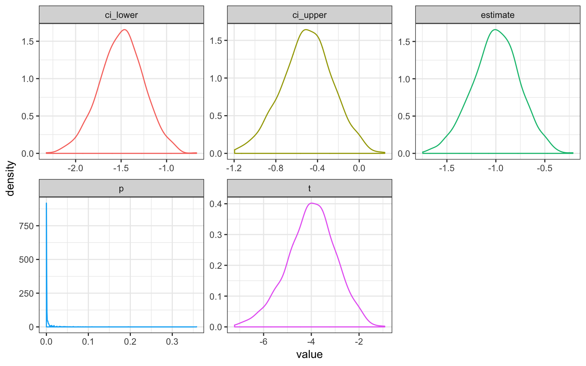

# Simulating Data {#sim_data}

This tutorial details a few ways I simulate data. I'll be using some functions from my [`faux` package](https://github.com/debruine/faux) to make it easier to generate sets of variables with specific correlations.


```r
library(tidyverse)
library(faux) # devtools::install_github("debruine/faux")
set.seed(8675309) # this makes sure your script uses the same set of random numbers each time you run the full script (never set this inside a function or loop)
```

## Independent samples

Let's start with a simple independent-samples design where the variables are from a normal distribution. Each subject produces one score (in condition A or B). What we need to know about these scores is:

* How many subjects are in each condition?
* What are the score means?
* What are the score variances?

### Parameters {#ind-params}

I start simulation scripts by setting parameters for these values.


```r
A_sub_n <- 50
B_sub_n <- 50
A_mean <- 10
B_mean <- 11
A_sd <- 2.5
B_sd <- 2.5
```

### Scores

We can the generate the scores using the `rnorm()` <a class='glossary' target='_blank' title='A named section of code that can be reused.' href='https://psyteachr.github.io/glossary/f#function'>function</a>.


```r
A_scores <- rnorm(A_sub_n, A_mean, A_sd)
B_scores <- rnorm(B_sub_n, B_mean, B_sd)
```

You can stop here and just analyse your simulated data with `t.test(A_scores, B_scores)`, but usualy you want to get your simulated data into a data table that looks like what you might eventually import from a CSV file with your actual experimental data.

I always use the `tidyverse` for <a class='glossary' target='_blank' title='The process of preparing data for visualisation and statistical analysis.' href='https://psyteachr.github.io/glossary/d#data-wrangling'>data wrangling</a>, so I'll create a data table using the `tibble()` function (but you can use `data.frame()` if you must). We need to know what condition each subject is in, so set the first `A_sub_n` values to "A" and the next `B_sub_n` values to "B". Then set the score to the `A_scores` <a class='glossary' target='_blank' title='To combine strings or vectors.' href='https://psyteachr.github.io/glossary/c#concatenate'>concatenated</a> to the `B_scores`.


```r
dat <- tibble(
  sub_condition = rep( c("A", "B"), c(A_sub_n, B_sub_n) ),
  score = c(A_scores, B_scores)
)
```

### Check your data

Always examine your simulated data after you generate it to make sure it looks like you want.


```r
summary_dat <- dat %>%
  group_by(sub_condition) %>%
  summarise(n = n() ,
            mean = mean(score),
            sd = sd(score))
```


sub_condition     n     mean      sd
--------------  ---  -------  ------
A                50   10.257   2.149
B                50   11.005   2.500

<div class="info">
<p>Your means and SDs won't be <strong>exactly</strong> what you specified because those parameters are for population and you are taking a sample. The larger your <code>sub_n</code>, the closer these values will usually be to the parameters you specify.</p>
</div>

### Analysis

Now you can analyse your simulated data.


```r
t.test(score~sub_condition, dat)
```

```
## 
## 	Welch Two Sample t-test
## 
## data:  score by sub_condition
## t = -1.6044, df = 95.843, p-value = 0.1119
## alternative hypothesis: true difference in means is not equal to 0
## 95 percent confidence interval:
##  -1.6735571  0.1774477
## sample estimates:
## mean in group A mean in group B 
##        10.25673        11.00478
```

### Function

You can wrap all this in a function so you can run it many times to do a power calculation. Put all your parameters as <a class='glossary' target='_blank' title='A variable that provides input to a function.' href='https://psyteachr.github.io/glossary/a#argument'>arguments</a> to the function.


```r
ind_sim <- function(A_sub_n, B_sub_n, A_mean, B_mean, A_sd, B_sd) {
  A_scores <- rnorm(A_sub_n, A_mean, A_sd)
  B_scores <- rnorm(B_sub_n, B_mean, B_sd)
  
  dat <- tibble(
    sub_condition = rep( c("A", "B"), c(A_sub_n, B_sub_n) ),
    score = c(A_scores, B_scores)
  )
  t <- t.test(score~sub_condition, dat)
  
  # return just the values you care about
  list(
    t = t$statistic,
    ci_lower = t$conf.int[1],
    ci_upper = t$conf.int[2],
    p = t$p.value,
    estimate = t$estimate[1] - t$estimate[2]
  )
}
```

Now run your new function with the values you used above.


```r
ind_sim(50, 50, 10, 11, 2.5, 2.5)
```

```
## $t
##        t 
## -1.16975 
## 
## $ci_lower
## [1] -1.56612
## 
## $ci_upper
## [1] 0.4052779
## 
## $p
## [1] 0.245173
## 
## $estimate
## mean in group A 
##      -0.5804213
```


<div class="try">
<p>Run the function with the parameters from the example above. Run it a few times and see how the results compare. What happens if you change a parameter? Edit the list at the end of the function to return more values of interest, like the means for A and B.</p>
</div>

Now you can use this function to run many simulations. There are a lot of ways to do this. The pattern below uses the `map_df` function from the `purrr` package.


```r
simulation <- purrr::map_df(1:1000, ~ind_sim(50, 50, 10, 11, 2.5, 2.5))
```

<div class="info">
<p>The function <code>map_df</code> takes two arguments, a vector and a function, and returns a dataframe. It runs the function once for each item in the vector, so the vector <code>1:1000</code> above runs the <code>ind_sim()</code> function 1000 times.</p>
<p>The <code>purrr::map()</code> functions can also set arguments in the function from the items in the vector. We aren't doing that here, but will use that pattern later.</p>
</div>

Now you can graph the data from your simulations.


```r
simulation %>%
  gather(stat, value, t:estimate) %>%
  ggplot() + 
  geom_density(aes(value, color = stat), show.legend = FALSE) +
  facet_wrap(~stat, scales = "free")
```

<div class="figure" style="text-align: center">

<p class="caption">(\#fig:paired-sim-fig)Distribution of results from simulated independent samples data</p>
</div>

You can calculate power as the proportion of simulations on which the p-value was less than your alpha.


```r
alpha <- 0.05
power <- mean(simulation$p < alpha)
```

Your power for the parameters above is 0.496.


## Paired samples

Now let's try a paired-samples design where the variables are from a normal distribution. Each subject produces two scores (in conditions A and B). What we need to know about these two scores is:

* How many subjects?
* What are the score means?
* What are the score variances?
* What is the correlation between the scores?

### Parameters {#paired-params}


```r
sub_n <- 100
A_mean <- 10
B_mean <- 11
A_sd <- 2.5
B_sd <- 2.5
AB_r <- 0.5
```

### Correlated Scores

You can then use `rnorm_multi()` to generate a data table with simulated values for correlated scores:


```r
dat <- faux::rnorm_multi(
  n = sub_n, 
  vars = 2, 
  cors = AB_r, 
  mu = c(A_mean, B_mean), 
  sd = c(A_sd, B_sd), 
  varnames = c("A", "B")
)
```

### Check your data

Now check your data; `faux` has a function `check_sim_stats()` that gives you the correlation table, means, and SDs for each numeric column in a data table.


var       A      B    mean     sd
----  -----  -----  ------  -----
A      1.00   0.51    9.81   2.29
B      0.51   1.00   10.81   2.57

### Analysis

Finally, you can analyse your simulated data.


```r
t.test(dat$A, dat$B, paired = TRUE)
```

```
## 
## 	Paired t-test
## 
## data:  dat$A and dat$B
## t = -4.1238, df = 99, p-value = 7.761e-05
## alternative hypothesis: true difference in means is not equal to 0
## 95 percent confidence interval:
##  -1.479129 -0.518129
## sample estimates:
## mean of the differences 
##              -0.9986288
```

### Function

The function is set up the same way as before. Set the arguments to the relevant parameters, construct the data table, run the t-test, and return the values you care about.


```r
paired_sim <- function(sub_n, A_mean, B_mean, A_sd, B_sd, AB_r) {

  dat <- faux::rnorm_multi(
    n = sub_n, 
    vars = 2, 
    cors = AB_r, 
    mu = c(A_mean, B_mean), 
    sd = c(A_sd, B_sd), 
    varnames = c("A", "B")
  )
  t <- t.test(dat$A, dat$B, paired = TRUE)
  
  # return just the values you care about
  list(
    t = t$statistic,
    ci_lower = t$conf.int[1],
    ci_upper = t$conf.int[2],
    p = t$p.value,
    estimate = t$estimate
  )
}
```

Run 1000 simulations and graph the results.


```r
simulation <- purrr::map_df(1:1000, ~paired_sim(100, 10, 11, 2.5, 2.5, .5))
```


```r
simulation %>%
  gather(stat, value, t:estimate) %>%
  ggplot() + 
  geom_density(aes(value, color = stat), show.legend = FALSE) +
  facet_wrap(~stat, scales = "free")
```

<div class="figure" style="text-align: center">

<p class="caption">(\#fig:ind-sim-fig)Distribution of results from simulated paired samples data</p>
</div>


```r
alpha <- 0.05
power <- mean(simulation$p < alpha)
```

Your power for the parameters above is 0.984.

## Intercept model

Now I'm going to show you a different way to simulate the same design. This might seem excessively complicated, but you will need this pattern when you start simulating data for [mixed effects models](#sim_lmer).

### Parameters

Remember, we used the following parameters to set up our simulation above:


```r
sub_n <- 100
A_mean <- 10
B_mean <- 11
A_sd <- 2.5
B_sd <- 2.5
AB_r <- 0.5
```

From these, we can calculate the grand intercept (the overall mean regardless of condition), and the effect of condition (the mean of B minus A).


```r
grand_i <- (A_mean + B_mean)/2
AB_effect <- B_mean - A_mean
```

We also need to think about variance a little differently. First, calculate the pooled variance as the mean of the variances for A and B (remember, variance is SD squared).


```r
pooled_var <- (A_sd^2 + B_sd^2)/2
```

<div class="warning">
<p>If the SDs for A and B are very different, this suggests a more complicated data generation model. For this tutorial we'll assume the score variance is similar for conditions A and B.</p>
</div>

The variance of the subject intercepts is `r` times this pooled variance and the error variance is what is left over. We take the square root (`sqrt()`) to set the subject intercept and error SDs for simulation later.


```r
sub_sd <- sqrt(pooled_var * AB_r)
error_sd <- sqrt(pooled_var * (1-AB_r))
```

<div class="info">
<p>You can think about the subject intercept variance as how much subjects vary in the score in general, regardless of condition. If they vary a lot, in comparison to the random &quot;error&quot; variation, then scores in the two conditions will be highly correlated. If they don't vary much (or random variation from trial to trial is quite large), then scores won't be well correlated.</p>
</div>

### Subject intercepts

Now we use these variables to create a data table for our subjects. Each subject gets an ID and a **random intercept** (`sub_i`). The intercept is simulated from a random normal distribution with a mean of 0 and an SD of `sub_sd`. This represents how much higher or lower than the average score each subject tends to be (regardless of condition).


```r
sub <- tibble(
  sub_id = 1:sub_n,
  sub_i = rnorm(sub_n, 0, sub_sd)
)
```

### Observations

Next, set up a table where each row represents one observation. We'll use one of my favourite functions for simulation: `expand.grid()`. This creates every possible combination of the listed factors. Here, we're using it to create a row for each subject in each condition, since this is a fully within-subjects design.


```r
obs <- expand.grid(
  sub_id = 1:sub_n,
  condition = c("A", "B")
)
```

### Calculate the score

Next, we join the subject table so each row has the information about the subject's random intercept and then calculate the score. I've done it in a few steps below for clarity. The score is just the sum of:

* the overall mean (`grand_i`)
* the subject-specific intercept (`sub_i`)
* the effect of condition (-50% of `AB_effect` for condition A and +50% of `AB_effect` for condition B)
* the error term (simulated from a normal distribution with mean of 0 and SD of `error_sd`)


```r
dat <- obs %>%
  left_join(sub, by = "sub_id") %>%
  mutate(
    condition.e = recode(condition, "A" = -0.5, "B" = 0.5),
    effect = AB_effect * condition.e,
    error = rnorm(nrow(.), 0, error_sd),
    score = grand_i + sub_i + effect + error
  )
```

<div class="info">
<p>The variable <code>condition.e</code> &quot;effect codes&quot; condition, which we will use later in a mixed effect model. You can learn more about <a href="https://debruine.github.io/posts/coding-schemes/">coding schemes</a> here.</p>
</div>

You can use the following code to put the data table into a more familiar "wide" format.


```r
dat_wide <- dat %>%
  select(sub_id, condition, score) %>%
  spread(condition, score)
```


Then you can use the `check_sim_stats` function to check this looks correct (remove the subject ID to leave it out of the table, since it's numeric).


var       A      B    mean     sd
----  -----  -----  ------  -----
A      1.00   0.41    9.93   2.04
B      0.41   1.00   11.33   2.03

### Analyses

You can analyse the data with a paired-samples t-test from the wide format:


```r
t.test(dat_wide$A, dat_wide$B, paired = TRUE)
```

```
## 
## 	Paired t-test
## 
## data:  dat_wide$A and dat_wide$B
## t = -6.303, df = 99, p-value = 8.154e-09
## alternative hypothesis: true difference in means is not equal to 0
## 95 percent confidence interval:
##  -1.8365839 -0.9571096
## sample estimates:
## mean of the differences 
##               -1.396847
```

Or in the long format:


```r
t.test(score ~ condition, dat, paired = TRUE)
```

```
## 
## 	Paired t-test
## 
## data:  score by condition
## t = -6.303, df = 99, p-value = 8.154e-09
## alternative hypothesis: true difference in means is not equal to 0
## 95 percent confidence interval:
##  -1.8365839 -0.9571096
## sample estimates:
## mean of the differences 
##               -1.396847
```

You can analyse the data with ANOVA.


```r
afex::aov_4(score ~ (condition.e | sub_id), data = dat)
```

```
## Anova Table (Type 3 tests)
## 
## Response: score
##        Effect    df  MSE         F ges p.value
## 1 condition.e 1, 99 2.46 39.73 *** .11  <.0001
## ---
## Signif. codes:  0 '***' 0.001 '**' 0.01 '*' 0.05 '+' 0.1 ' ' 1
```


You can even analyse the data with a mixed effects model. 


```r
lmem <- lmerTest::lmer(score ~ condition.e + (1 | sub_id), data = dat)

summary(lmem)$coefficients %>% 
  # nicer formatting with p-values
  as_tibble(rownames = "Factor") %>%
  mutate_if(~max(.) < .001, ~as.character(signif(., 3))) %>% 
  knitr::kable(digits = 3)
```


Factor         Estimate   Std. Error   df   t value  Pr(>|t|) 
------------  ---------  -----------  ---  --------  ---------
(Intercept)      10.631        0.170   99    62.381  2.77e-81 
condition.e       1.397        0.222   99     6.303  8.15e-09 

## Functions

We can put everything together into a function where you specify the subject number, means, SDs and correlation, it translates this into the intercept specification, and returns a data table.


```r
sim_paired_data <- function(sub_n = 100, 
                            A_mean, B_mean, 
                            A_sd, B_sd, AB_r) {
  
  grand_i <- (A_mean + B_mean)/2
  AB_effect <- B_mean - A_mean
  pooled_var <- (A_sd^2 + B_sd^2)/2
  sub_sd <- sqrt(pooled_var * AB_r)
  error_sd <- sqrt(pooled_var * (1-AB_r))
  
  sub <- tibble(
    sub_id = 1:sub_n,
    sub_i = rnorm(sub_n, 0, sub_sd)
  )
  
  expand.grid(
    sub_id = 1:sub_n,
    condition = c("A", "B")
  ) %>%
  left_join(sub, by = "sub_id") %>%
  mutate(
    effect = case_when(
      condition == "A" ~ AB_effect * -0.5,
      condition == "B" ~ AB_effect * +0.5
    ),
    error = rnorm(nrow(.), 0, error_sd),
    score = grand_i + sub_i + effect + error
  ) %>%
  select(sub_id, condition, score) %>%
  spread(condition, score)
}
```


```r
sim_paired_data(100, 10, 12, 2.5, 2.5, .5) %>%
  select(-sub_id) %>%
  faux::check_sim_stats(usekable = TRUE)
```


var       A      B    mean     sd
----  -----  -----  ------  -----
A      1.00   0.48    9.86   2.41
B      0.48   1.00   11.84   2.29

Set the `sub_n` to a very high number to see that the means, SDs and correlations are what you specified.


```r
sim_paired_data(10000, 0, 0.5, 1, 1, .25) %>%
  select(-sub_id) %>%
  faux::check_sim_stats(usekable = TRUE)
```


var       A      B   mean     sd
----  -----  -----  -----  -----
A      1.00   0.25    0.0   1.00
B      0.25   1.00    0.5   1.01

It might be more useful to create functions to translate back and forth from the distribution specification to the intercept specification.

### Distribution to intercept specification


```r
dist2int <- function(mu = 0, sd = 1, r = 0) {
  A_mean <- mu[1]
  # set B_mean to A_mean if mu has length 1
  B_mean <- ifelse(is.na(mu[2]), mu[1], mu[2])
  A_sd <- sd[1]
  # set B_sd to A_sd if sd has length 1
  B_sd <- ifelse(is.na(sd[2]), sd[1], sd[2])
  AB_r <- r
  pooled_var <- (A_sd^2 + B_sd^2)/2
  
  list(
    grand_i = (A_mean + B_mean)/2,
    AB_effect = B_mean - A_mean,
    sub_sd = sqrt(pooled_var * AB_r),
    error_sd = sqrt(pooled_var * (1-AB_r))
  )
}
```


```r
dist2int()
```


               
----------  ---
grand_i       0
AB_effect     0
sub_sd        0
error_sd      1
----------  ---


```r
dist2int(mu = c(100, 105), sd = c(10.5, 9.5), r = 0.5)
```


                   
----------  -------
grand_i      102.50
AB_effect      5.00
sub_sd         7.08
error_sd       7.08
----------  -------

### Intercept to distribution specification


```r
int2dist <- function(grand_i = 0, 
                     AB_effect = 0, 
                     sub_sd = 0, 
                     error_sd = 1) {
  pooled_var <- sub_sd^2 + error_sd^2
   
  list(
    A_mean = grand_i - 0.5 * AB_effect,
    B_mean = grand_i + 0.5 * AB_effect,
    A_sd = sqrt(pooled_var),
    B_sd = sqrt(pooled_var),
    AB_r = sub_sd^2 / pooled_var
  )
}
```


```r
int2dist()
```


            
-------  ---
A_mean     0
B_mean     0
A_sd       1
B_sd       1
AB_r       0
-------  ---


```r
int2dist(102.5, 5, 0.708, 0.708)
```


                 
-------  --------
A_mean    100.000
B_mean    105.000
A_sd        1.001
B_sd        1.001
AB_r        0.500
-------  --------

We can then use either specification to generate data with either technique.


