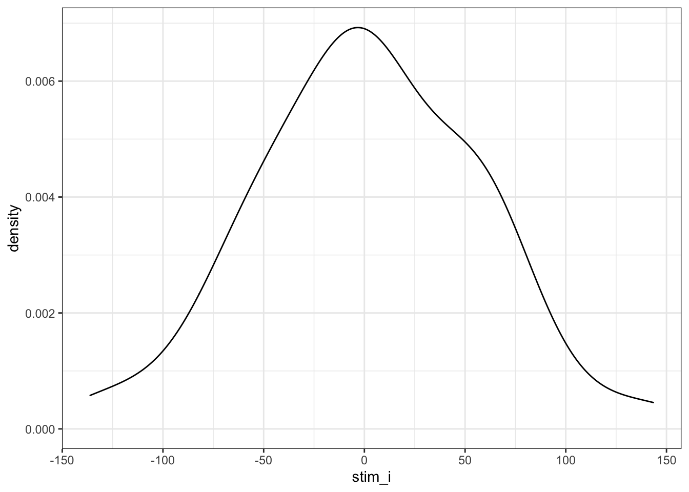
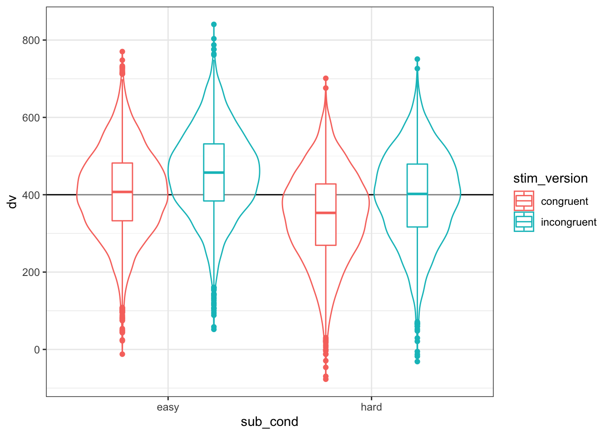
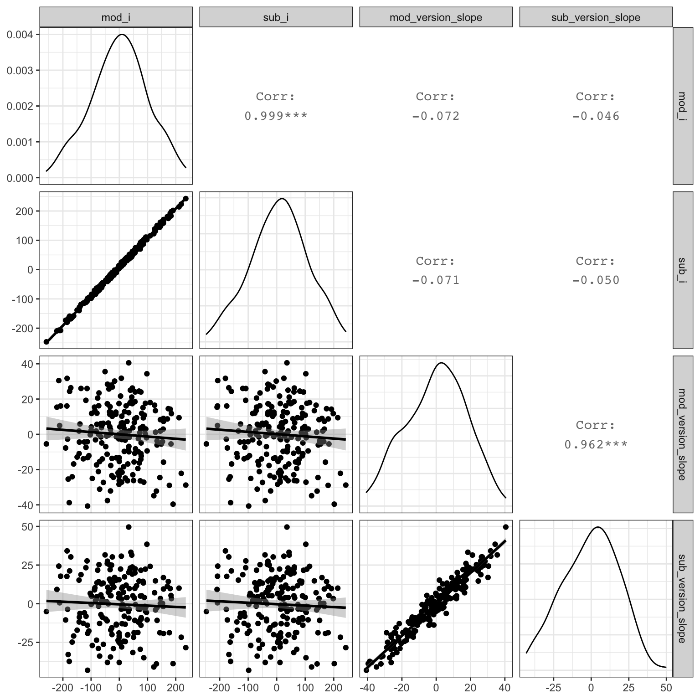

# Simulating Mixed Effects {#sim_lmer}

I'm going to walk through one example of simulating a dataset with random effects. 

Download an RMarkdown file for this lesson [with code](R/04_sim_lmer_code.Rmd) or [without code](R/04_sim_lmer_stub.Rmd).

I'll generate data for a Stroop task where people (`subjects`) say the colour of  colour words (`stimuli`) shown in each of two versions (`congruent` and `incongruent`). Subjects are in one of two conditions (`hard` and `easy`). The dependent variable (`DV`) is reaction time. 

* congruent: <span style="color: red;">RED</span>, <span style="color: orange;">ORANGE</span>, <span style="color: #ead21e;">YELLOW</span>, <span style="color: green;">GREEN</span>, <span style="color: blue;">BLUE</span>, <span style="color: purple;">PURPLE</span>
* incongruent: <span style="color: #ead21e;">RED</span>, <span style="color: green;">ORANGE</span>, <span style="color: blue;">YELLOW</span>, <span style="color: purple;">GREEN</span>, <span style="color: red;">BLUE</span>, <span style="color: orange;">PURPLE</span>

We expect people to have faster reaction times for congruent stimuli than incongruent stimuli (main effect of version) and to be faster in the easy condition than the hard condition (main effect of condition). We'll look at some different interaction patterns below. 

## Setup

We'll use the `tidyverse` to manipulate data frames and `lmerTest` (which includes `lmer`) to run the mixed effects models. I also like to set the `scipen` and `digits` options to get rid of scientific notation in lmer output.

When you're simulating data, you should start your script by setting a seed. You can use any number you like, this just makes sure that you get the same results every time you run the script. (Thanks for reminding me to add and explain this, [Tim Morris](https://twitter.com/tmorris_mrc)!)


```r
library(tidyverse) # for data wrangling, pipes, and good dataviz
library(lmerTest)  # for mixed effect models
library(GGally)    # makes it easy to plot relationships between variables
# devtools::install_github("debruine/faux")
library(faux)      # for simulating correlated variables

options("scipen"=10, "digits"=4) # control scientific notation
set.seed(8675309) # Jenny, I've got your number
```

<div class="warning">
<p>If you are running repeated simulations (e.g., for a power calculation), make sure you never use <code>set.seed</code> inside of a function that creates random numbers, or the function will always give you the exact same numbers.</p>
</div>

## Random intercepts

### Subjects {#rint-subjects}

First, we need to generate a sample of subjects. Each subject will have slightly faster or slower reaction times on average; this is their random intercept (`sub_i`). We'll model it from a normal distribution with a mean of 0 and SD of 100ms. 

We also add between-subject variables here. Each subject is in only one condition, so assign half `easy` and half `hard`. Set the number of subjects as `sub_n` at the beginning so you can change this in the future with only one edit.


```r
sub_n  <- 200 # number of subjects in this simulation
sub_sd <- 100 # SD for the subjects' random intercept

sub <- tibble(
  sub_id = 1:sub_n,
  sub_i  = rnorm(sub_n, 0, sub_sd), # random intercept
  sub_cond = rep(c("easy","hard"), each = sub_n/2) # between-subjects factor
)
```

<div class="info">
<p>If you already have <a href="/data/pilot_data.csv">pilot data</a>, you can estimate a realistic SD for the subjects’ random intercepts using the following code.</p>
</div>


```r
pilot_data <- read_csv("pilot_data.csv")
pilot_mod <- lmer(dv ~ 1 + (1 | sub_id) + (1 | stim_id), data = pilot_data)

sub_sd <- VarCorr(pilot_mod) %>% 
  as.data.frame() %>%
  filter(grp == "sub_id") %>% 
  pull(sdcor)
```

I like to check my simulations at every step with a graph. We expect subjects in  `hard` and `easy` conditions to have approximately equal intercepts.


```r
ggplot(sub, aes(sub_i, color = sub_cond)) +
  geom_density()
```

<div class="figure" style="text-align: center">

<p class="caption">(\#fig:plot-subject)Double-check subject intercepts</p>
</div>

### Stimuli {#rint-stimuli}

Now, we generate a sample of stimuli. Each stimulus will have slightly faster or slower reaction times on average; this is their random intercept (`stim_i`). We'll model it from a normal distribution with a mean of 0 and SD of 50ms (it seems reasonable to expect less variability between words than people for this task). Stimulus version (`congruent` vs `incongruent`) is a within-stimulus variable, so we don't need to add it here.


```r
stim_n  <- 50 # number of stimuli in this simulation
stim_sd <- 50 # SD for the stimuli's random intercept

stim <- tibble(
  stim_id = 1:stim_n,
  stim_i = rnorm(stim_n, 0, stim_sd) # random intercept
)
```

<div class="info">
If you want to simulate data using the exact stimuli you already have pilot data for, you can calculate their random intercepts using the following code and use that instead of generating a random sample with the same SD.
</p>
</div>


```r
pilot_data <- read_csv("pilot_data.csv")
pilot_mod <- lmer(dv ~ 1 + (1 | sub_id) + (1 | stim_id), data = pilot_data)

stim <- ranef(pilot_mod)$stim_id %>%
  as_tibble(rownames = 'stim_id') %>%
  rename(stim_i = `(Intercept)`)
```


Plot the random intercepts to double-check they look like you expect.


```r
ggplot(stim, aes(stim_i)) +
  geom_density()
```

<div class="figure" style="text-align: center">

<p class="caption">(\#fig:plot-stimuli)Double-check stimulus intercepts</p>
</div>

### Trials {#rint-trials}

Now we put the subjects and stimuli together. In this study, all subjects respond to all stimuli in both upright and inverted versions, but subjects are in only one condition. The function `crossing` gives you a data frame with all possible combinations of the arguments. Add the data specific to each subject and stimulus by left joining the `sub` and `stim` data frames.


```r
trials <- crossing(
  sub_id = sub$sub_id, # get subject IDs from the sub data table
  stim_id = stim$stim_id, # get stimulus IDs from the stim data table
  stim_version = c("congruent", "incongruent") # all subjects see both congruent and incongruent versions of all stimuli
) %>%
  left_join(sub, by = "sub_id") %>% # includes the intercept and conditin for each subject
  left_join(stim, by = "stim_id")   # includes the intercept for each stimulus
```


Table: (\#tab:crossing)Subject- and stimulus-specific random intercepts for 2 subjects and 2 stimuli

 sub_id   stim_id  stim_version     sub_i  sub_cond    stim_i
-------  --------  -------------  -------  ---------  -------
      1         1  congruent       -99.66  easy        -4.418
      1         1  incongruent     -99.66  easy        -4.418
      1         2  congruent       -99.66  easy         4.057
      1         2  incongruent     -99.66  easy         4.057
      2         1  congruent        72.18  easy        -4.418
      2         1  incongruent      72.18  easy        -4.418
      2         2  congruent        72.18  easy         4.057
      2         2  incongruent      72.18  easy         4.057


## Calculate DV {#rint-dv}

Now we can calculate the DV by adding together an overall intercept (mean RT for all trials), the subject-specific intercept, the stimulus-specific intercept, the effect of subject condition, the interaction between condition and version (set to 0 for this first example), the effect of stimulus version, and an error term. 

### Fixed effects

We set these effects in raw units (ms) and [effect-code](https://debruine.github.io/posts/coding-schemes.html) the subject condition and stimulus version. It's usually easiest to interpret if you recode the level that you predict will be larger as +0.5 and the level you predict will be smaller as -0.5. So when we set the effect of subject condition (`sub_cond_eff`) to 50, that means the average difference between the easy and hard condition is 50ms. `Easy` is effect-coded as -0.5 and `hard` is effect-coded as +0.5, which means that trials in the easy condition have -0.5 \* 50ms (i.e., -25ms) added to their reaction time, while trials in the hard condition have +0.5 \* 50ms (i.e., +25ms) added to their reaction time.


```r
# set variables to use in calculations below
grand_i          <- 400 # overall mean DV
sub_cond_eff     <- 50  # mean difference between conditions: hard - easy
stim_version_eff <- 50  # mean difference between versions: incongruent - congruent
cond_version_ixn <-  0  # interaction between version and condition
error_sd         <- 25  # residual (error) SD
```

<div class="info">
<p>We set the error SD fairly low here so that it’s easier to see how the parameters we set map onto the analysis output. You can calculate a realistic error SD from pilot data with the code below.</p>
</div>


```r
pilot_data <- read_csv("pilot_data.csv")
pilot_mod <- lmer(dv ~ 1 + (1 | sub_id) + (1 | stim_id), data = pilot_data)

error_sd <- VarCorr(pilot_mod) %>% 
  as.data.frame() %>%
  filter(grp == "Residual") %>% 
  pull(sdcor)
```

The code chunk below effect-codes the condition and version factors (important for the analysis below), generates an error term for each trial, and generates the DV.


```r
dat <- trials %>%
  mutate(
    # effect-code subject condition and stimulus version
    sub_cond.e = recode(sub_cond, "hard" = -0.5, "easy" = +0.5),
    stim_version.e = recode(stim_version, "congruent" = -0.5, "incongruent" = +0.5),
    # calculate error term (normally distributed residual with SD set above)
    err = rnorm(nrow(.), 0, error_sd),
    # calculate DV from intercepts, effects, and error
    dv = grand_i + sub_i + stim_i + err +
         (sub_cond.e * sub_cond_eff) + 
         (stim_version.e * stim_version_eff) + 
         (sub_cond.e * stim_version.e * cond_version_ixn) # in this example, this is always 0 and could be omitted
  )
```

As always, graph to make sure you've simulated the general pattern you expected.


```r
ggplot(dat, aes(sub_cond, dv, color = stim_version)) +
  geom_hline(yintercept = grand_i) +
  geom_violin(alpha = 0.5) +
  geom_boxplot(width = 0.2, position = position_dodge(width = 0.9))
```

<div class="figure" style="text-align: center">

<p class="caption">(\#fig:plot-dv)Double-check the simulated pattern</p>
</div>

Let's take a concrete example.


Table: (\#tab:plot-dv)Subject 1's reaction time to stimulus 1 in the congruent condition

 sub_id   stim_id  stim_version     sub_i  sub_cond    stim_i   sub_cond.e   stim_version.e      err      dv
-------  --------  -------------  -------  ---------  -------  -----------  ---------------  -------  ------
      1         1  congruent       -99.66  easy        -4.418          0.5             -0.5   -8.318   287.6


The DV is equal to the grand intercept (400) plus the subject's intercept (-99.6582) plus the stimulus' intercept (-4.4182) plus the effect code for the subject's condition (easy = -0.5) times the effect size for subject condition (50) plus the effect code for stimulus version (congruent = -0.5) times the effect size for stimulus version (50) plus some random error (-8.3181).

400 + -99.6582 + -4.4182 + (-0.5 \* 50) + (-0.5 \* 50) + -8.3181 = 287.6054


In this simulated dataset, the grand intercept is 401.6, the mean difference between subject conditions is 60.8, and the mean difference between stimulus versions is -49.7.

### Interactions

If you want to simulate an interaction, it can be tricky to figure out what to set the main effects and interaction effect to. It can be easier to think about the simple main effects for each cell. Create four new variables and set them to the deviations from the overall mean you'd expect for each condition (so they should add up to 0). Here, we're simulating a small effect of version in the hard condition (50ms difference) and double that effect of version in the easy condition (100ms difference).


```r
# set variables to use in calculations below
grand_i    <- 400
hard_congr <- -25
hard_incon <- +25
easy_congr <- -50
easy_incon <- +50
error_sd   <-  25
```

Use the code below to transform the simple main effects above into main effects and interactions for use in the equations below.


```r
# calculate main effects and interactions from simple effects above

# mean difference between easy and hard conditions
sub_cond_eff     <- (easy_congr + easy_incon)/2 -
                    (hard_congr + hard_incon)/2
# mean difference between incongruent and congruent versions
stim_version_eff <- (hard_incon + easy_incon)/2 - 
                    (hard_congr + easy_congr)/2  
# interaction between version and condition
cond_version_ixn <- (easy_incon - easy_congr) -
                    (hard_incon - hard_congr) 
```

Then generate the DV the same way we did above, but also add the interaction effect multiplied by the effect-coded subject condition and stimulus version.


```r
dat <- trials %>%
  mutate(
    # effect-code subject condition and stimulus version
    sub_cond.e = recode(sub_cond, "hard" = -0.5, "easy" = +0.5),
    stim_version.e = recode(stim_version, "congruent" = -0.5, "incongruent" = +0.5),
    # calculate error term (normally distributed residual with SD set above)
    err = rnorm(nrow(.), 0, error_sd),
    # calculate DV from intercepts, effects, and error
    dv = grand_i + sub_i + stim_i + err +
         (sub_cond.e * sub_cond_eff) + 
         (stim_version.e * stim_version_eff) + 
         (sub_cond.e * stim_version.e * cond_version_ixn)
  )
```


```r
ggplot(dat, aes(sub_cond, dv, color = stim_version)) +
  geom_hline(yintercept = grand_i) +
  geom_violin(alpha = 0.5) +
  geom_boxplot(width = 0.2, position = position_dodge(width = 0.9))
```

<div class="figure" style="text-align: center">

<p class="caption">(\#fig:plot-ixn)Double-check the interaction between condition and version</p>
</div>

Let's look at subject 1's reaction time to stimulus 1 in the congruent condition in more detail again.


Table: (\#tab:plot-ixn)Subject 1's reaction time to stimulus 1 in the congruent condition

 sub_id   stim_id  stim_version     sub_i  sub_cond    stim_i   sub_cond.e   stim_version.e      err      dv
-------  --------  -------------  -------  ---------  -------  -----------  ---------------  -------  ------
      1         1  congruent       -99.66  easy        -4.418          0.5             -0.5   -31.74   214.2


The DV is equal to the grand intercept (400) plus the subject's intercept (-99.6582) plus the stimulus' intercept (-4.4182) plus the effect code for the subject's condition (easy = -0.5) times the effect size for subject condition (0) plus the effect code for stimulus version (congruent = -0.5) times the effect size for stimulus version(75) plus the effect code for the subject's condition (easy = -0.5) times the effect code for stimulus version (congruent = -0.5) times the effect size for the interaction (50) plus some random error (-31.7369).

400 + -99.6582 + -4.4182 + (-0.5 \* 0) + (-0.5 \* 75) + (-0.5 \* -0.5 \* 50) + -31.7369 = 214.1866


```r
group_by(dat, sub_cond, stim_version) %>%
  summarise(m = mean(dv) - grand_i %>% round(1)) %>%
  ungroup() %>%
  spread(stim_version, m) %>%
  knitr::kable()
```


sub_cond    congruent   incongruent
---------  ----------  ------------
easy           -42.49         57.10
hard           -28.55         21.68

## Analysis {#rint-analysis}

New we will run a linear mixed effects model with `lmer` and look at the summary. 


```r
mod <- lmer(dv ~ sub_cond.e * stim_version.e +
              (1 | sub_id) + 
              (1 | stim_id),
            data = dat)

mod.sum <- summary(mod)

mod.sum
```

```
## Linear mixed model fit by REML. t-tests use Satterthwaite's method [
## lmerModLmerTest]
## Formula: dv ~ sub_cond.e * stim_version.e + (1 | sub_id) + (1 | stim_id)
##    Data: dat
## 
## REML criterion at convergence: 187453
## 
## Scaled residuals: 
##    Min     1Q Median     3Q    Max 
## -3.760 -0.663  0.006  0.659  3.714 
## 
## Random effects:
##  Groups   Name        Variance Std.Dev.
##  sub_id   (Intercept) 9185     95.8    
##  stim_id  (Intercept) 3069     55.4    
##  Residual              629     25.1    
## Number of obs: 20000, groups:  sub_id, 200; stim_id, 50
## 
## Fixed effects:
##                            Estimate Std. Error        df t value Pr(>|t|)    
## (Intercept)                 401.937     10.360   131.461   38.80   <2e-16 ***
## sub_cond.e                   10.737     13.558   197.968    0.79     0.43    
## stim_version.e               74.908      0.355 19749.013  211.19   <2e-16 ***
## sub_cond.e:stim_version.e    49.357      0.709 19749.013   69.57   <2e-16 ***
## ---
## Signif. codes:  0 '***' 0.001 '**' 0.01 '*' 0.05 '.' 0.1 ' ' 1
## 
## Correlation of Fixed Effects:
##             (Intr) sb_cn. stm_v.
## sub_cond.e  0.000               
## stim_versn. 0.000  0.000        
## sb_cnd.:s_. 0.000  0.000  0.000
```

### Sense checks {#rint-sense-checks}

First, check that your groups make sense (`mod.sum$ngrps`). 

* The number of obs should be the total number of trials analysed. 
* `sub_id` should be what we set `sub_n` to above (200).
* `stim_id` should be what we set `stim_n` to above (50).


```
##  sub_id stim_id 
##     200      50
```

Next, look at the random effects (`mod.sum$varcor`). 

* The SD for `sub_id` should be near the `sub_sd` of 100.
* The SD for `stim_id` should be near the `stim_sd` of 50. 
* The residual SD should be near the `error_sd` of 25.


```
##  Groups   Name        Std.Dev.
##  sub_id   (Intercept) 95.8    
##  stim_id  (Intercept) 55.4    
##  Residual             25.1
```

Finally, look at the fixed effects (`mod.sum$coefficients`). 

* The estimate for the Intercept should be near the `grand_i` of 400. 
* The main effect of `sub_cond.e` should be near what we calculated for `sub_cond_eff` (0). 
* The main effect of `stim_version.e` should be near what we calculated for `stim_version_eff` (75)
* The interaction between `sub_cond.e`:`stim_version.e` should be near what we calculated for `cond_version_ixn` (50).


```
##                           Estimate Std. Error      df  t value  Pr(>|t|)
## (Intercept)                 401.94    10.3599   131.5  38.7972 7.475e-74
## sub_cond.e                   10.74    13.5581   198.0   0.7919 4.294e-01
## stim_version.e               74.91     0.3547 19749.0 211.1856 0.000e+00
## sub_cond.e:stim_version.e    49.36     0.7094 19749.0  69.5750 0.000e+00
```

### Random effects {#rint-ranef}

Plot the subject intercepts from our code above (`sub$sub_i`) against the subject intercepts calculcated by `lmer` (`ranef(mod)$sub_id`).


```r
ranef(mod)$sub_id %>%
  as_tibble(rownames = "sub_id") %>%
  rename(mod_sub_i = `(Intercept)`) %>%
  mutate(sub_id = as.integer(sub_id)) %>%
  left_join(sub, by = "sub_id") %>%
  ggplot(aes(sub_i,mod_sub_i)) +
  geom_point() +
  geom_smooth(method = "lm") +
  xlab("Simulated random intercepts (sub_i)") +
  ylab("Modeled random intercepts")
```

<div class="figure" style="text-align: center">

<p class="caption">(\#fig:plot-sub-ranef)Compare simulated subject random intercepts to those from the model</p>
</div>

Plot the stimulus intercepts from our code above (`stim$stim_i`) against the stimulus intercepts calculcated by `lmer` (`ranef(mod)$stim_id`).


```r
ranef(mod)$stim_id %>%
  as_tibble(rownames = "stim_id") %>%
  rename(mod_stim_i = `(Intercept)`) %>%
  mutate(stim_id = as.integer(stim_id)) %>%
  left_join(stim, by = "stim_id") %>%
  ggplot(aes(stim_i,mod_stim_i)) +
  geom_point() +
  geom_smooth(method = "lm") +
  xlab("Simulated random intercepts (stim_i)") +
  ylab("Modeled random intercepts")
```

<div class="figure" style="text-align: center">

<p class="caption">(\#fig:plot-stim-ranef)Compare simulated stimulus random intercepts to those from the model</p>
</div>


## Function {#rint-function}

You can put the code above in a function so you can run it more easily and change the parameters. I removed the plot and set the argument defaults to the same as the example above, but you can set them to other patterns.


```r
sim_lmer <- function( sub_n = 200,
                      sub_sd = 100,
                      stim_n = 50,
                      stim_sd = 50,
                      grand_i = 400,
                      hard_congr = -25,
                      hard_incon = +25,
                      easy_congr = -50,
                      easy_incon = +50,
                      error_sd = 25) {
  sub <- tibble(
    sub_id = 1:sub_n,
    sub_i  = rnorm(sub_n, 0, sub_sd),
    sub_cond = rep(c("hard","easy"), each = sub_n/2)
  )
  
  stim <- tibble(
    stim_id = 1:stim_n,
    stim_i = rnorm(stim_n, 0, stim_sd)
  )

  # mean difference between easy and hard conditions
  sub_cond_eff     <- (easy_congr + easy_incon)/2 -
                      (hard_congr + hard_incon)/2
  # mean difference between incongruent and congruent versions
  stim_version_eff <- (hard_incon + easy_incon)/2 - 
                      (hard_congr + easy_congr)/2  
  # interaction between version and condition
  cond_version_ixn <- (easy_incon - easy_congr) -
                      (hard_incon - hard_congr) 
  
  dat <- crossing(
    sub_id = sub$sub_id,
    stim_id = stim$stim_id,
    stim_version = c("congruent", "incongruent")
  ) %>%
    left_join(sub, by = "sub_id") %>%
    left_join(stim, by = "stim_id") %>%
    mutate(
      # effect-code subject condition and stimulus version
      sub_cond.e = recode(sub_cond, "hard" = -0.5, "easy" = +0.5),
      stim_version.e = recode(stim_version, "congruent" = -0.5, "incongruent" = +0.5),
      # calculate error term (normally distributed residual with SD set above)
      err = rnorm(nrow(.), 0, error_sd),
      # calculate DV from intercepts, effects, and error
      dv = grand_i + sub_i + stim_i + err +
           (sub_cond.e * sub_cond_eff) + 
           (stim_version.e * stim_version_eff) + 
           (sub_cond.e * stim_version.e * cond_version_ixn)
    )
  
  mod <- lmer(dv ~ sub_cond.e * stim_version.e +
                (1 | sub_id) + 
                (1 | stim_id),
              data = dat)
  
  mod.sum <- summary(mod)
  
  return(mod.sum)
}
```

Run the function with the default values.


```r
sim_lmer()
```

```
## Linear mixed model fit by REML. t-tests use Satterthwaite's method [
## lmerModLmerTest]
## Formula: dv ~ sub_cond.e * stim_version.e + (1 | sub_id) + (1 | stim_id)
##    Data: dat
## 
## REML criterion at convergence: 187436
## 
## Scaled residuals: 
##    Min     1Q Median     3Q    Max 
## -4.317 -0.673  0.001  0.662  4.808 
## 
## Random effects:
##  Groups   Name        Variance Std.Dev.
##  sub_id   (Intercept) 8822     93.9    
##  stim_id  (Intercept) 2680     51.8    
##  Residual              629     25.1    
## Number of obs: 20000, groups:  sub_id, 200; stim_id, 50
## 
## Fixed effects:
##                            Estimate Std. Error        df t value Pr(>|t|)    
## (Intercept)                 390.831      9.886   139.375   39.53   <2e-16 ***
## sub_cond.e                  -12.415     13.287   197.999   -0.93     0.35    
## stim_version.e               74.822      0.355 19749.001  210.96   <2e-16 ***
## sub_cond.e:stim_version.e    49.649      0.709 19749.001   69.99   <2e-16 ***
## ---
## Signif. codes:  0 '***' 0.001 '**' 0.01 '*' 0.05 '.' 0.1 ' ' 1
## 
## Correlation of Fixed Effects:
##             (Intr) sb_cn. stm_v.
## sub_cond.e  0.000               
## stim_versn. 0.000  0.000        
## sb_cnd.:s_. 0.000  0.000  0.000
```

Try changing some variables to simulate null effects.


```r
sim_lmer(hard_congr = 0,
         hard_incon = 0,
         easy_congr = 0,
         easy_incon = 0)
```

```
## Linear mixed model fit by REML. t-tests use Satterthwaite's method [
## lmerModLmerTest]
## Formula: dv ~ sub_cond.e * stim_version.e + (1 | sub_id) + (1 | stim_id)
##    Data: dat
## 
## REML criterion at convergence: 187254
## 
## Scaled residuals: 
##    Min     1Q Median     3Q    Max 
## -4.147 -0.663  0.000  0.669  3.997 
## 
## Random effects:
##  Groups   Name        Variance Std.Dev.
##  sub_id   (Intercept) 11708    108.2   
##  stim_id  (Intercept)  2721     52.2   
##  Residual               621     24.9   
## Number of obs: 20000, groups:  sub_id, 200; stim_id, 50
## 
## Fixed effects:
##                             Estimate Std. Error         df t value Pr(>|t|)    
## (Intercept)                 407.6919    10.6293   164.0377   38.36   <2e-16 ***
## sub_cond.e                   -7.7499    15.3061   197.9969   -0.51     0.61    
## stim_version.e               -0.0676     0.3525 19749.0010   -0.19     0.85    
## sub_cond.e:stim_version.e     0.5561     0.7051 19749.0010    0.79     0.43    
## ---
## Signif. codes:  0 '***' 0.001 '**' 0.01 '*' 0.05 '.' 0.1 ' ' 1
## 
## Correlation of Fixed Effects:
##             (Intr) sb_cn. stm_v.
## sub_cond.e  0.000               
## stim_versn. 0.000  0.000        
## sb_cnd.:s_. 0.000  0.000  0.000
```

## Random slopes

In the example so far we've ignored random variation among subjects or stimuli in the size of the fixed effects (i.e., **random slopes**). 

First, let's reset the parameters we set above.


```r
sub_n            <- 200 # number of subjects in this simulation
sub_sd           <- 100 # SD for the subjects' random intercept
stim_n           <- 50  # number of stimuli in this simulation
stim_sd          <- 50  # SD for the stimuli's random intercept
grand_i          <- 400 # overall mean DV
sub_cond_eff     <- 50  # mean difference between conditions: hard - easy
stim_version_eff <- 50  # mean difference between versions: incongruent - congruent
cond_version_ixn <-  0  # interaction between version and condition
error_sd         <- 25  # residual (error) SD
```

### Subjects {#rslope-subjects}

In addition to generating a random intercept for each subject, now we will also generate a random slope for any within-subject factors. The only within-subject factor in this design is `stim_version`. The main effect of `stim_version` is set to 50 above, but different subjects will show variation in the size of this effect. That's what the random slope captures. We'll set `sub_version_sd` below to the SD of this variation and use this to calculate the random slope (`sub_version_slope`) for each subject.

Also, it's likely that the variation between subjects in the size of the effect of version is related in some way to between-subject variation in the intercept. So we want the random intercept and slope to be correlated. Here, we'll simulate a case where subjects who have slower (larger) reaction times across the board show a smaller effect of condition, so we set `sub_i_version_cor` below to a negative number (-0.2).

The code below creates two variables (`sub_i`, `sub_version_slope`) that are correlated with r = -0.2, means of 0, and SDs equal to what we set `sub_sd` above and `sub_version_sd` below.


```r
sub_version_sd <- 20
sub_i_version_cor <- -0.2

sub <- faux::rnorm_multi(
  n = sub_n, 
  vars = 2, 
  r = sub_i_version_cor,
  mu = 0, # means of random intercepts and slopes are always 0
  sd = c(sub_sd, sub_version_sd),
  varnames = c("sub_i", "sub_version_slope")
) %>%
  mutate(
    sub_id = 1:sub_n,
    sub_cond = rep(c("easy","hard"), each = sub_n/2) # between-subjects factor
  )
```

Plot to double-check it looks sensible.


```r
ggplot(sub, aes(sub_i, sub_version_slope, color = sub_cond)) +
  geom_point() +
  geom_smooth(method = lm)
```

<div class="figure" style="text-align: center">

<p class="caption">(\#fig:plot-subject-slope-cor)Double-check slope-intercept correlations</p>
</div>


### Stimuli {#rslope-stimuli}

In addition to generating a random intercept for each stimulus, we will also generate a random slope for any within-stimulus factors. Both `stim_version` and `sub_condition` are within-stimulus factors (i.e., all stimuli are seen in both `congruent` and `incongruent` versions and both `easy` and `hard` conditions). So the main effects of version and condition (and their interaction) will vary depending on the stimulus.

They will also be correlated, but in a more complex way than above. You need to set the correlations for all pairs of slopes and intercept. Let's set the correlation between the random intercept and each of the slopes to -0.4 and the slopes all correlate with each other +0.2 (You could set each of the six correlations separately if you want, though). 


```r
stim_version_sd <- 10 # SD for the stimuli's random slope for stim_version
stim_cond_sd <- 30 # SD for the stimuli's random slope for sub_cond
stim_cond_version_sd <- 15 # SD for the stimuli's random slope for sub_cond:stim_version
stim_i_cor <- -0.4 # correlations between intercept and slopes
stim_s_cor <- +0.2 # correlations among slopes

# specify correlations for rnorm_multi (one of several methods)
stim_cors <- c(stim_i_cor, stim_i_cor, stim_i_cor,
                           stim_s_cor, stim_s_cor,
                                       stim_s_cor)
stim <- rnorm_multi(
  n = stim_n, 
  vars = 4, 
  r = stim_cors, 
  mu = 0, # means of random intercepts and slopes are always 0
  sd = c(stim_sd, stim_version_sd, stim_cond_sd, stim_cond_version_sd),
  varnames = c("stim_i", "stim_version_slope", "stim_cond_slope", "stim_cond_version_slope")
) %>%
  mutate(
    stim_id = 1:stim_n
  )
```

Here, we're simulating different SDs for different effects, so our plot should reflect this. The graph below uses the ``ggpairs` function fromt he `GGally` package to quickly visualise correlated variables.


```r
GGally::ggpairs(stim, columns = 1:4, 
                lower = list(continuous = "smooth"),
                progress = FALSE)
```

<div class="figure" style="text-align: center">

<p class="caption">(\#fig:plot-stim-slope-cor)Double-check slope-intercept correlations</p>
</div>


### Trials {#rslope-trials}

Now we put the subjects and stimuli together in the same way as before.


```r
trials <- crossing(
  sub_id = sub$sub_id, # get subject IDs from the sub data table
  stim_id = stim$stim_id, # get stimulus IDs from the stim data table
  stim_version = c("congruent", "incongruent") # all subjects see both congruent and incongruent versions of all stimuli
) %>%
  left_join(sub, by = "sub_id") %>% # includes the intercept, slope, and conditin for each subject
  left_join(stim, by = "stim_id")   # includes the intercept and slopes for each stimulus
```


Table: (\#tab:rslope-crossing)Subject- and stimulus-specific random intercepts and slopes for 2 subjects and 2 stimuli

 sub_id   stim_id  stim_version     sub_i   sub_version_slope  sub_cond    stim_i   stim_version_slope   stim_cond_slope   stim_cond_version_slope
-------  --------  -------------  -------  ------------------  ---------  -------  -------------------  ----------------  ------------------------
      1         1  congruent       -63.15              -23.61  easy         11.54              -0.0276             28.62                     7.068
      1         1  incongruent     -63.15              -23.61  easy         11.54              -0.0276             28.62                     7.068
      1         2  congruent       -63.15              -23.61  easy        -14.00               1.4777            -26.67                    -1.602
      1         2  incongruent     -63.15              -23.61  easy        -14.00               1.4777            -26.67                    -1.602
      2         1  congruent        98.23               -2.32  easy         11.54              -0.0276             28.62                     7.068
      2         1  incongruent      98.23               -2.32  easy         11.54              -0.0276             28.62                     7.068
      2         2  congruent        98.23               -2.32  easy        -14.00               1.4777            -26.67                    -1.602
      2         2  incongruent      98.23               -2.32  easy        -14.00               1.4777            -26.67                    -1.602


## Calculate DV {#rslope-dv}

Now we can calculate the DV by adding together an overall intercept (mean RT for all trials), the subject-specific intercept, the stimulus-specific intercept, the effect of subject condition, the stimulus-specific slope for condition, the effect of stimulus version, the stimulus-specific slope for version, the subject-specific slope for condition, the interaction between condition and version (set to 0 for this example), the stimulus-specific slope for the interaction between condition and version, and an error term. 


```r
dat <- trials %>%
  mutate(
    # effect-code subject condition and stimulus version
    sub_cond.e = recode(sub_cond, "hard" = -0.5, "easy" = +0.5),
    stim_version.e = recode(stim_version, "congruent" = -0.5, "incongruent" = +0.5),
    # calculate trial-specific effects by adding overall effects and slopes
    cond_eff = sub_cond_eff + stim_cond_slope,
    version_eff = stim_version_eff + stim_version_slope + sub_version_slope,
    cond_version_eff = cond_version_ixn + stim_cond_version_slope,
    # calculate error term (normally distributed residual with SD set above)
    err = rnorm(nrow(.), 0, error_sd),
    # calculate DV from intercepts, effects, and error
    dv = grand_i + sub_i + stim_i + err +
         (sub_cond.e * cond_eff) + 
         (stim_version.e * version_eff) + 
         (sub_cond.e * stim_version.e * cond_version_eff)
  )
```

As always, graph to make sure you've simulated the general pattern you expected.


```r
ggplot(dat, aes(sub_cond, dv, color = stim_version)) +
  geom_hline(yintercept = grand_i) +
  geom_violin(alpha = 0.5) +
  geom_boxplot(width = 0.2, position = position_dodge(width = 0.9))
```

<div class="figure" style="text-align: center">

<p class="caption">(\#fig:rslope-plot-dv)Double-check the simulated pattern</p>
</div>

## Analysis {#rslope-analysis}

New we'll run a linear mixed effects model with `lmer` and look at the summary. You specify random slopes by adding the within-level effects to the random intercept specifications. Since the only within-subject factor is version, the random effects specification for subjects is `(1 + stim_version.e | sub_id)`. Since both condition and version are within-stimuli factors, the random effects specification for stimuli is `(1 + stim_version.e*sub_cond.e | stim_id)`.

<div class="info">
<p><a href="http://talklab.psy.gla.ac.uk/KeepItMaximalR2.pdf">Keep It Maximal</a> is a great paper on how and why to set random slopes <em>maximally</em> like this.</p>
</div>

This model will take a lot longer to run than one without random slopes specified.


```r
mod <- lmer(dv ~ sub_cond.e * stim_version.e +
              (1 + stim_version.e | sub_id) + 
              (1 + stim_version.e*sub_cond.e | stim_id),
            data = dat)
```

```
## Warning in checkConv(attr(opt, "derivs"), opt$par, ctrl = control$checkConv, :
## Model failed to converge with max|grad| = 0.00958044 (tol = 0.002, component 1)
```

```r
mod.sum <- summary(mod)

mod.sum
```

```
## Linear mixed model fit by REML. t-tests use Satterthwaite's method [
## lmerModLmerTest]
## Formula: dv ~ sub_cond.e * stim_version.e + (1 + stim_version.e | sub_id) +  
##     (1 + stim_version.e * sub_cond.e | stim_id)
##    Data: dat
## 
## REML criterion at convergence: 188385
## 
## Scaled residuals: 
##    Min     1Q Median     3Q    Max 
## -4.729 -0.661 -0.007  0.666  3.937 
## 
## Random effects:
##  Groups   Name                      Variance Std.Dev. Corr             
##  sub_id   (Intercept)               9871.5   99.36                     
##           stim_version.e             326.0   18.06    -0.07            
##  stim_id  (Intercept)               2468.3   49.68                     
##           stim_version.e              85.3    9.23    -0.46            
##           sub_cond.e                 688.5   26.24    -0.25  0.08      
##           stim_version.e:sub_cond.e  269.6   16.42    -0.44  0.27  0.55
##  Residual                            627.8   25.06                     
## Number of obs: 20000, groups:  sub_id, 200; stim_id, 50
## 
## Fixed effects:
##                           Estimate Std. Error     df t value Pr(>|t|)    
## (Intercept)                 406.39       9.94 157.01   40.89  < 2e-16 ***
## sub_cond.e                   61.72      14.54 221.91    4.25 0.000032 ***
## stim_version.e               49.91       1.86 142.77   26.83  < 2e-16 ***
## sub_cond.e:stim_version.e    -2.35       3.52 161.06   -0.67     0.51    
## ---
## Signif. codes:  0 '***' 0.001 '**' 0.01 '*' 0.05 '.' 0.1 ' ' 1
## 
## Correlation of Fixed Effects:
##             (Intr) sb_cn. stm_v.
## sub_cond.e  -0.045              
## stim_versn. -0.264  0.013       
## sb_cnd.:s_. -0.204  0.044  0.123
## convergence code: 0
## Model failed to converge with max|grad| = 0.00958044 (tol = 0.002, component 1)
```

### Sense checks {#rslope-sense-checks}

First, check that your groups make sense (`mod.sum$ngrps`). 

* `sub_id` = `sub_n` (200)
* `stim_id` = `stim_n` (50)


```
##  sub_id stim_id 
##     200      50
```

Next, look at the SDs for the random effects (`mod.sum$varcor`). 

* Group:`sub_id`
   * `(Intercept)` ~= `sub_sd` (100)
   * `stim_version.e` ~= `sub_version_sd` (20)
* Group: `stim_id`
   * `(Intercept)` ~= `stim_sd` (50)
   * `stim_version.e` ~= `stim_version_sd` (10)
   * `sub_cond.e` ~= `stim_cond_sd` (30)
   * `stim_version.e:sub_cond.e` ~= `stim_cond_version_sd` (15)
* Residual ~= `error_sd` (25)


```
##  Groups   Name                      Std.Dev. Corr             
##  sub_id   (Intercept)               99.36                     
##           stim_version.e            18.06    -0.07            
##  stim_id  (Intercept)               49.68                     
##           stim_version.e             9.23    -0.46            
##           sub_cond.e                26.24    -0.25  0.08      
##           stim_version.e:sub_cond.e 16.42    -0.44  0.27  0.55
##  Residual                           25.06
```

The correlations are a bit more difficult to parse. The first column under `Corr` shows the correlation between the random slope for that row and the random intercept. So for `stim_version.e` under `sub_id`, the correlation should be close to `sub_i_version_cor` (-0.2). For all three random slopes under `stim_id`, the correlation with the random intercept should be near `stim_i_cor` (-0.4) and their correlations with each other should be near `stim_s_cor` (0.2).


```
##  Groups   Name                      Std.Dev. Corr             
##  sub_id   (Intercept)               99.36                     
##           stim_version.e            18.06    -0.07            
##  stim_id  (Intercept)               49.68                     
##           stim_version.e             9.23    -0.46            
##           sub_cond.e                26.24    -0.25  0.08      
##           stim_version.e:sub_cond.e 16.42    -0.44  0.27  0.55
##  Residual                           25.06
```

Finally, look at the fixed effects (`mod.sum$coefficients`). 

* `(Intercept)` ~= `grand_i` (400)
* `sub_cond.e` ~= `sub_cond_eff` (50)
* `stim_version.e` ~= `stim_version_eff` (50)
* `sub_cond.e`:`stim_version.e` ~= `cond_version_ixn` (0)


```
##                           Estimate Std. Error    df t value  Pr(>|t|)
## (Intercept)                406.393      9.938 157.0 40.8945 1.274e-85
## sub_cond.e                  61.722     14.537 221.9  4.2458 3.203e-05
## stim_version.e              49.914      1.860 142.8 26.8297 1.252e-57
## sub_cond.e:stim_version.e   -2.352      3.524 161.1 -0.6675 5.054e-01
```

### Random effects {#rslope-ranef}

Plot the subject intercepts and slopes from our code above (`sub$sub_i`) against the subject intercepts and slopes calculcated by `lmer` (`ranef(mod)$sub_id`).


```r
ranef(mod)$sub_id %>%
  as_tibble(rownames = "sub_id") %>%
  rename(mod_i = `(Intercept)`,
         mod_version_slope = stim_version.e) %>%
  mutate(sub_id = as.integer(sub_id)) %>%
  left_join(sub, by = "sub_id") %>%
  select(mod_i, sub_i, 
         mod_version_slope,  sub_version_slope) %>%
  GGally::ggpairs(lower = list(continuous = "smooth"),
                progress = FALSE)
```

<div class="figure" style="text-align: center">

<p class="caption">(\#fig:rslope-plot-sub-ranef)Compare simulated subject random effects to those from the model</p>
</div>

Plot the stimulus intercepts and slopes from our code above (`stim$stim_i`) against the stimulus intercepts and slopes calculcated by `lmer` (`ranef(mod)$stim_id`).


```r
ranef(mod)$stim_id %>%
  as_tibble(rownames = "stim_id") %>%
  rename(mod_i = `(Intercept)`,
         mod_version_slope = stim_version.e,
         mod_cond_slope = sub_cond.e,
         mod_cond_version_slope = `stim_version.e:sub_cond.e`) %>%
  mutate(stim_id = as.integer(stim_id)) %>%
  left_join(stim, by = "stim_id") %>%
  select(mod_i, stim_i, 
         mod_version_slope, stim_version_slope, 
         mod_cond_slope, stim_cond_slope, 
         mod_cond_version_slope, stim_cond_version_slope) %>%
  GGally::ggpairs(lower = list(continuous = "smooth"),
                progress = FALSE)
```

<div class="figure" style="text-align: center">

<p class="caption">(\#fig:rslope-plot-stim-ranef)Compare simulated stimulus random effects to those from the model</p>
</div>

## Function {#rslope-function}

You can put the code above in a function so you can run it more easily and change the parameters. I removed the plot and set the argument defaults to the same as the example above, but you can set them to other patterns.


```r
sim_lmer <- function( sub_n = 200,
                      sub_sd = 100,
                      sub_version_sd = 20, 
                      sub_i_version_cor = -0.2,
                      stim_n = 50,
                      stim_sd = 50,
                      stim_version_sd = 10,
                      stim_cond_sd = 30,
                      stim_cond_version_sd = 15,
                      stim_i_cor = -0.4,
                      stim_s_cor = +0.2,
                      grand_i = 400,
                      hard_congr = -25,
                      hard_incon = +25,
                      easy_congr = -50,
                      easy_incon = +50,
                      error_sd = 25) {
  sub <- rnorm_multi(
    n = sub_n, 
    vars = 2, 
    cors = sub_i_version_cor,
    mu = 0, # means of random intercepts and slopes are always 0
    sd = c(sub_sd, sub_version_sd),
    varnames = c("sub_i", "sub_version_slope")
  ) %>%
    mutate(
      sub_id = 1:sub_n,
      sub_cond = rep(c("easy","hard"), each = sub_n/2) # between-subjects factor
    )
  
  stim_cors <- c(stim_i_cor, stim_i_cor, stim_i_cor,
                             stim_s_cor, stim_s_cor,
                                         stim_s_cor)
  stim <- rnorm_multi(
    n = stim_n, 
    vars = 4, 
    cors = stim_cors, 
    mu = 0, # means of random intercepts and slopes are always 0
    sd = c(stim_sd, stim_version_sd, stim_cond_sd, stim_cond_version_sd),
    varnames = c("stim_i", "stim_version_slope", "stim_cond_slope", "stim_cond_version_slope")
  ) %>%
    mutate(
      stim_id = 1:stim_n
    )
  
  # mean difference between easy and hard conditions
  sub_cond_eff     <- (easy_congr + easy_incon)/2 -
                      (hard_congr + hard_incon)/2
  # mean difference between incongruent and congruent versions
  stim_version_eff <- (hard_incon + easy_incon)/2 - 
                      (hard_congr + easy_congr)/2  
  # interaction between version and condition
  cond_version_ixn <- (easy_incon - easy_congr) -
                      (hard_incon - hard_congr) 
  
  trials <- crossing(
    sub_id = sub$sub_id, # get subject IDs from the sub data table
    stim_id = stim$stim_id, # get stimulus IDs from the stim data table
    stim_version = c("congruent", "incongruent") # all subjects see both congruent and incongruent versions of all stimuli
  ) %>%
    left_join(sub, by = "sub_id") %>% # includes the intercept, slope, and conditin for each subject
    left_join(stim, by = "stim_id")   # includes the intercept and slopes for each stimulus
  
  dat <- trials %>%
    mutate(
      # effect-code subject condition and stimulus version
      sub_cond.e = recode(sub_cond, "hard" = -0.5, "easy" = +0.5),
      stim_version.e = recode(stim_version, "congruent" = -0.5, "incongruent" = +0.5),
      # calculate trial-specific effects by adding overall effects and slopes
      cond_eff = sub_cond_eff + stim_cond_slope,
      version_eff = stim_version_eff + stim_version_slope + sub_version_slope,
      cond_version_eff = cond_version_ixn + stim_cond_version_slope,
      # calculate error term (normally distributed residual with SD set above)
      err = rnorm(nrow(.), 0, error_sd),
      # calculate DV from intercepts, effects, and error
      dv = grand_i + sub_i + stim_i + err +
           (sub_cond.e * cond_eff) + 
           (stim_version.e * version_eff) + 
           (sub_cond.e * stim_version.e * cond_version_eff)
    )
  
  mod <- lmer(dv ~ sub_cond.e * stim_version.e +
                (1 + stim_version.e | sub_id) + 
                (1 + stim_version.e*sub_cond.e | stim_id),
              data = dat)

  mod.sum <- summary(mod)
  
  return(mod.sum)
}
```


Run the function with the default values.


```r
sim_lmer()
```

Try changing some variables to simulate null effects.


```r
sim_lmer(hard_congr = 0,
         hard_incon = 0,
         easy_congr = 0,
         easy_incon = 0)
```
