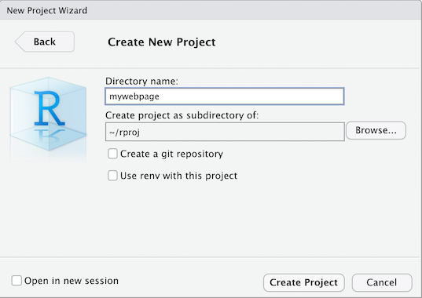
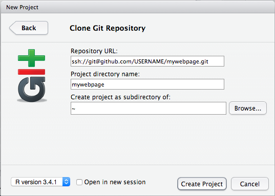
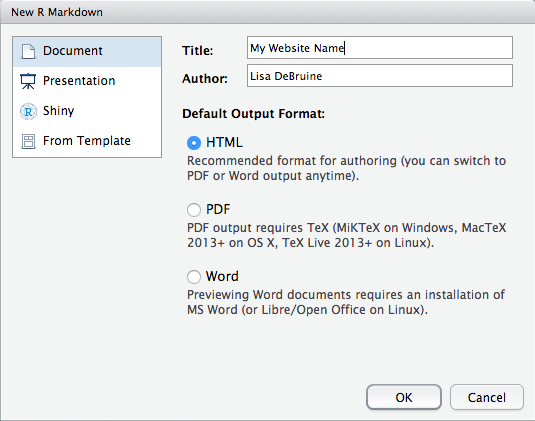
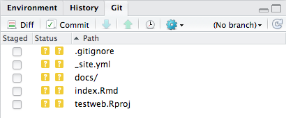
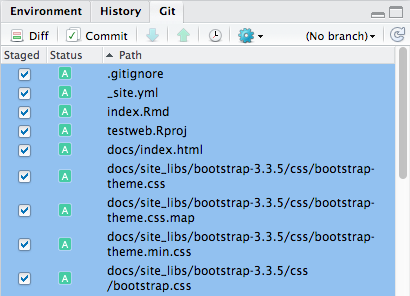
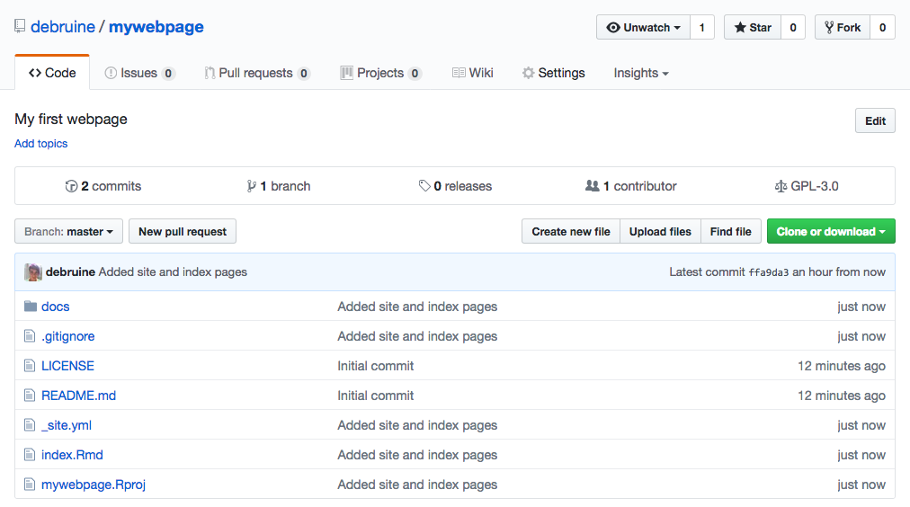

# Webpages

## Learning objectives

* [Create a simple webpage using R Markdown](#webpage-create)
* [Use version control with your files](#setup-git)
* [Create content in R Markdown](#webpage-content)
* [Link multiple pages](#webpage-pages)
* [Style your content using `css`](#webpage-styles)
* [Host your website on GitHub or GitLab](#webpage-online)


## Create a webpage {#webpage-create}

### Create a project 

1. Choose `New Project...` from the `File` menu (don't save any workspaces)
2. If you can't or don't want to install git, make a local website
    * Choose `New Directory` > `New Project...` 
    * Set your project name to "mywebpage"
    
    
3. If setting up a github or gitlab site, choose the `Version Control` option
    * If you don't have this option, [set up git](#setup-git) using the instructions in Appendix \@ref(#setup-git).
    * Choose the `Git` option to clone a project from a git repository
    * Set the `Repository URL` 
        This will look something like `https://github.com/USERAME/mywebpage`, `ssh://git@github.com/USERNAME/mywebpage.git` or `git@gitlab.com:USERNAME/mywebpage.git`. 
        Make sure to replace `USERNAME` with your GitHub or GitLab username and 
        `mywebpage` with the name of your project if you didn't use that name.
        
        
    * Type in your SSH passphrase if using the SSH option, or your github username and password if prompted

### Site header

This is where you can set options like whether to show a table of contents and what the navigation bar will look like. We'll edit this later to add a section menu.

1. Make a new file
    Choose `New File > Text File` from the `File` menu
2. Put the following text in the file:

    ```
    name: "mywebpage"  
    author: "YOUR NAME"  
    output_dir: "docs"  
    output:  
      html_document:  
        self_contained: no  
        theme: flatly  
    navbar:  
      title: "My First Webpage"  
    ```
    
3. Save the file as `_site.yml` (do not change the name)

### Site script (only for GitLab)

This file contains instructions for copying files from your private GitLab repository to the public web resources. You don't need it for a GitHub website because all the files are public.

1. Make a new file 
    Choose `New File > Text File` from the `File` menu
2. Put the following text in the file:

    ```
    pages:
      stage: deploy
      script:
      - mkdir .public
      - cp -r docs/* .public
      - mv .public public
      artifacts:
        paths:
        - public
      only:
      - master
    ```
    
3. Save the file as `.gitlab-ci.yml` (do not change the name)

### Main page

1. Make a new file
    Choose `New File > R Markdown...` from the `File` menu
    
2. Replace all of the default text with the following text:

    ```
    ---
    title: "My Website Name"
    ---
    
    I am a postgraduate student in the University of Glasgow's
    [Institute of Neuroscience and Psychology](http://www.gla.ac.uk/researchinstitutes/neurosciencepsychology/).
    I work with [Supervisor's Name](http://supervisor/website)
    ```
3. Personalise the website name, supervisor name, and supervisor website link.
4. Save the file as `index.Rmd` (do not change the name)


### Render the site

1. Type `rmarkdown::render_site()` into the lower left Console pane. You might get some error messages about the graphics engine. You can ignore those for now.
2. Click on the `docs` directory in the `Files` tab of the lower right pane
3. Click on `index.html` and choose `View in Web Browser`
4. Check if your links work, edit and repeat if they don't


## Add content {#webpage-content}

If you are comfortable with HTML, you can write most of your page in HTML. If not, I'd suggest using rmarkdown, whcih is a simple way to indicate headings, paragraphs, links, lists and images.

### Headings and paragraphs

Headings are prefaces with hashes `#`. The largest, title heading gets one hash and each subheading level adds another hash. 

Paragraphs don't require any special marks, they are just automatically created when you skip a line between blocks of text.

```
### Headings and paragraphs

Headings are prefaces with hashes `#`. The largest, title heading gets one hash and each subheading level adds another hash. 

Paragraphs don't require any special marks, they are just automatically created when you skip a line between blocks of text.
```

### Links

Links are just text surrounded by square brackets, followed by the URL surrounded by parentheses. Start the URL with `http://` if it's an external website. If you want to link to one of your own pages, you can just put the name of the page.

I can link to [Google](http://google.com) or to [my own main page](index.html).

```
I can link to [Google](http://google.com) or to [my own main page](index.html).
```

### Lists 

You can make bullet point lists by prefacing items with `*` or numeric lists by prefacing them with numbers. Make nested lists by indenting 4 spaces.

Face Research Lab:

* Permanent Staff
    * Lisa
    * Ben
* Postdocs
    * Iris
    * Ant
    * Kieran
* PhD Students
    * Danielle
    * Chengyang 
    * Vanessa
    * Jaimie

Things I need to do:

1. Finish this lesson
1. Write new R script for hormones project
1. Write reference letter
1. Check Moodle

```
Face Research Lab:

* Permanent Staff
    * Lisa
    * Ben
* Postdocs
    * Iris
    * Ant
    * Kieran
* PhD Students
    * Danielle
    * Chengyang 
    * Vanessa
    * Jaimie

Things I need to do:

1. Finish this lesson
1. Write new R script for hormones project
1. Write reference letter
1. Check Moodle
```

<div class="info">
<p>Notice how the numeric list uses all number <code>1</code>. You can use incrementing numbers if you want, but using all <code>1</code>s makes it easier to change the order of your items with out having the renumber.</p>
</div>

### Images

Images are created much like links. Just put an exclamation mark (`!`) before the first brasket and put some explanatory text (title and image credit) in the squre brackets, and the image location in the parentheses.


```

```


## Add pages {#webpage-pages}

1. Create a new .Rmd file for each webpage
2. Add content to the webpages (more on this below)
3. Type `rmarkdown::render_site()` in the Console window


## Styles {#webpage-styles}

### Change the theme

The `_site.yml` file `theme` option specifies the [Bootstrap theme](https://bootswatch.com/4-alpha/) to use for the page. You can use `default`, `cerulean`, `journal`, `flatly`, `readable`, `spacelab`, `united`, `cosmo`, `lumen`, `paper`, `sandstone`, `simplex`, and `yeti`. Annoyingly, there are no dark themes available by default.

```
name: "mywebpage"  
author: "YOUR NAME"  
output_dir: "docs"  
output:  
  html_document:  
    self_contained: no  
    theme: flatly  
    css: style.css
navbar:  
  title: "My First Webpage"  
```

### Add custom styles

You can also add a custom style sheet (a document that determines how each element of your website should look) by adding the line `css: style.css` under `html_document:` in the `_site.yml` file (as above).

Then you need to create a file named `style.css` and add your custom styles there. The web has thousands of guides to CSS, but [codeacademy](https://www.codecademy.com/en/tracks/htmlcss) has great interactive tutorials for learning html, css, and even more advanced web coding like javascript.

However, the basics of css are easy to learn and it's best to just start playing around with it. Add the following text to your `style.css` file and re-render the website using `rmarkdown::render_site()`.

### Change global fonts and colours

```
body {
  font-size: 2em;
  font-family: "Times New Roman";
  color: white;
  background-color: #660000;
}
```

<style>
  #body-example * {
    font-size: 2em;
    font-family: "Times New Roman";
    color: white;
    background-color: #660000;
  }
</style>

<div id="body-example">

This will make the text on your website larger, a different font, and change the text and background colours.

</div>

The theme you're using might have css that blocks the styles you're trying to change. You can add `!important` before the end colon to override that.
    
### Change certain elements

Maybe you only want to change the font colour for your headings, not the rest of the text. You can apply a style to a specific *element* type by specifying the element name before the curly brackets. 

```
h1, h2, h3 {
  text-align: center;
  color: hsl(0, 100%, 20%);
}

h3 {
  font-style: italic;
}

p {
  border: 1px solid green;
  padding: 10px;
  line-height: 2;
}

ul {
  border: 3px dotted red;
  border-radius: 10px;
  padding: 10px 30px;
}
```

<style>
  #h-example h2, 
  #h-example h3, 
  #h-example h4 {
    text-align: center;
    color: hsl(0, 100%, 20%);
  }
  
  #h-example h4 {
    font-style: italic;
  }
  
  #h-example p {
    border: 1px solid green;
    padding: 10px;
    line-height: 2;
  }
  
  #h-example ul {
    border: 3px dotted red;
    border-radius: 10px;
    padding: 10px 30px;
  }
</style>

<div id="h-example">

## Example using the styles above

The CSS above changes the styles for three levels of headers (`h2`, `h3`, `h4`) and sets the third level to italics.

### Level 3 header

It also gives paragraphs (`p`) a green border and double-spacing.

#### Level 4 header

Unordered Lists (`ul`) get:

* dotted red border
* round corners
* increased padding on top (`10px`) and sides (`30px`)

</div>


## Put your webpage online {#webpage-online}

### Save this version with git

1. Click on the `git` tab in the upper right pane
    
2. Stage your files
    Select all (cmd-A) and click on a checkbox in the `Staged` column to select all files
    
3. Commit your changes
    Click `Commit`. A new window will open. Type `Added site and index pages` in the `Commit message` box and click <a class="btn btn-default btn-xs">Commit</a>
    
4. Close the progress window and the commit window
5. Upload your changes
    + Click `Push` (the green up arrow)
    + Enter your SSH passphrase
    + Close the window when it's done
6. Go to your GitHub or GitLab page; the new files should be in your repository
    


### GitHub

To use a GitHub repository as a website, you need to set the source directory the first time you add files to the `docs` directory.

1. Go to the website for your GitHub repository (e.g., `https://github.com/username/mywebpage`)
2. Click on the `Settings` tab and scroll down to `GitHub Pages`
3. Under **`Source`**, choose `master branch /docs folder` and click **`Save`**
    
4. Click on the link that appears above (e.g., `https://debruine.github.io/mywebpage/`)

### GitLab

If you are working in GitLab, your webpage should be created in a minute or two. Just go to the URL like `https://myusername.gitlab.io/mywebpage/`.

