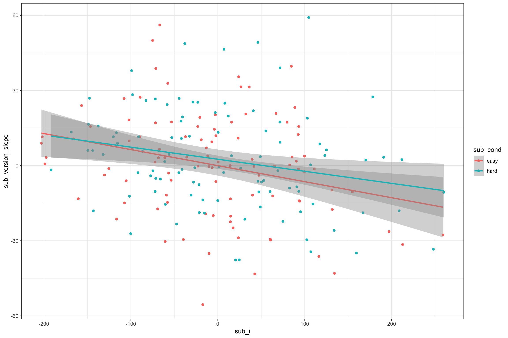
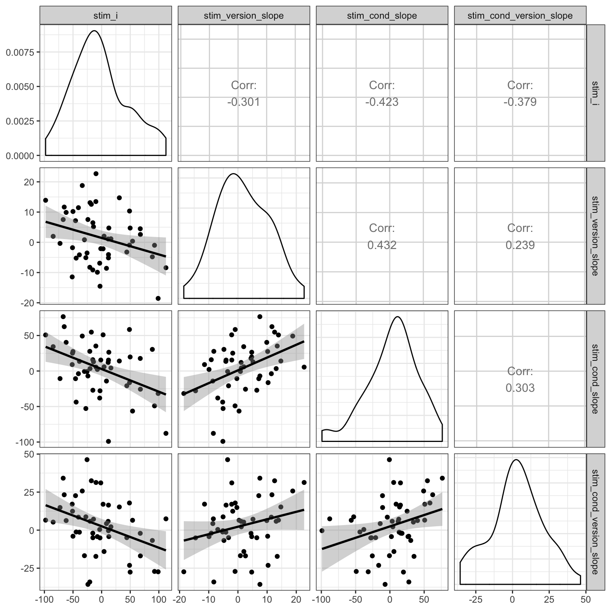
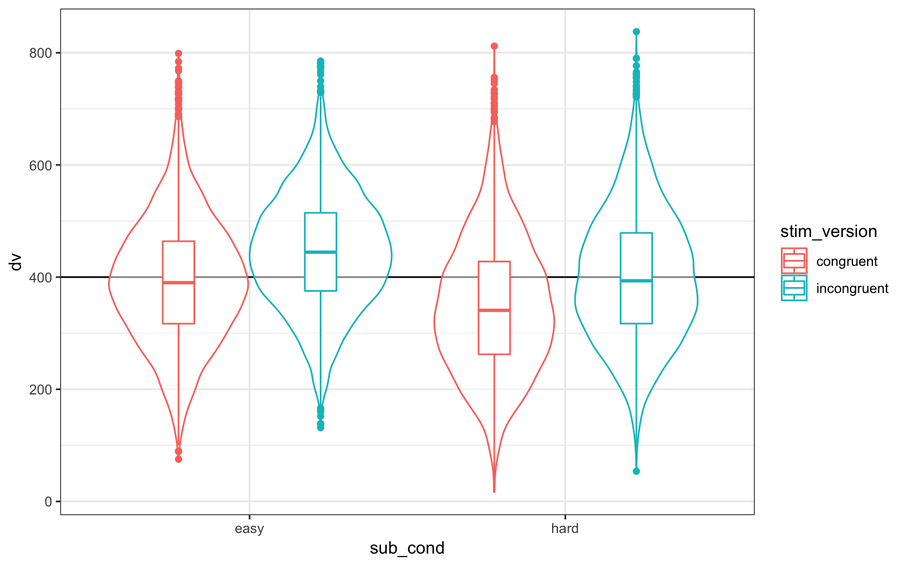
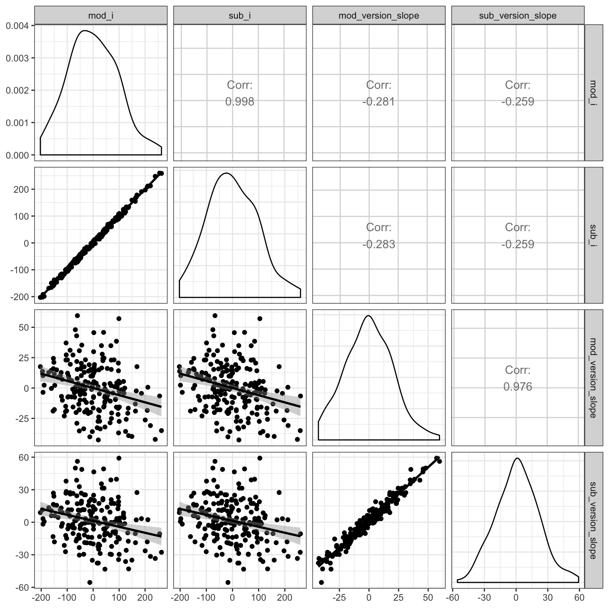
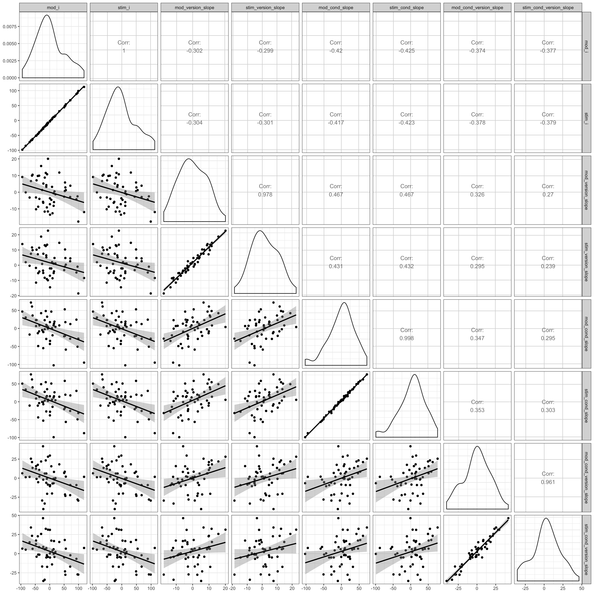

---
title: Simulating Random Slopes
author: ~
date: "2019-01-09"
slug: simulating-random-slopes
categories: ["rstats"]
tags: ["R", "simulation", "lmer", "lme4"]
---

This tutorial follows on from [Simulating Mixed Effects](simulating-mixed-effects) and expands it by simulating random slopes. You'll want to look at that tutorial to get an idea of how the example study is set up. To summarise:

* stim_version is a within-subject and within-stimulus factor (stimuli are shown in both of two versions: `congruent` and `incongruent`)
* sub_cond is a between-subject and within-stimulus factor (subjects are in one of two conditions: `easy` and `hard`)

## Setup


```r
library(tidyverse)
library(lmerTest)
library(GGally) # makes it easy to plot relationships between variables
options("scipen"=10, "digits"=4)
set.seed(8675309) # Jenny, I've got your number
```

## Simulate Random Effects

In the previous tutorial, the example used the following parameters:


```r
sub_n            <- 200 # number of subjects in this simulation
sub_sd           <- 100 # SD for the subjects' random intercept
stim_n           <- 50  # number of stimuli in this simulation
stim_sd          <- 50  # SD for the stimuli's random intercept
grand_i          <- 400 # overall mean DV
sub_cond_eff     <- 50  # mean difference between conditions: hard - easy
stim_version_eff <- 50  # mean difference between versions: incongruent - congruent
cond_version_ixn <-  0  # interaction between version and condition
error_sd         <- 25  # residual (error) SD
```

### Subjects

In addition to generating a random intercept for each subject, we will also generate a random slope for any within-subject factors. The only within-subject factor in this design is `stim_version`. The main effect of `stim_version` is set to 50 above, but different subjects will show variation in the size of this effect. That's what the random slope captures. We'll set `sub_version_sd` below to the SD of this variation and use this to calculate the random slope (`sub_version_slope`) for each subject.

Also, it's likely that the variation between subjects in the size of the effect of version is related in some way to between-subject variation in the intercept. So we want the random intercept and slope to be correlated. Here, we'll simulate a case where subjects who have slower (larger) reaction times across the board show a smaller effect of condition, so we set `sub_i_version_cor` below to a negative number (-0.2).

I'm writing a package that has functions to easily create correlated variables for simulations.  The function `rnorm_multi` generates `n` observations of `vars` variables with `mu` means and `sd` standard deviations with `cors` specific correlations. You can learn more about this function at my [Simulating Multiple Vectors](rnorm_multi) tutorial. You can use `devtools::install_github("debruine/faux")` to install the package.


```r
# devtools::install_github("debruine/faux")
library(faux)
```

<p class="info">If you don't want to install the package, you can just include the simplified function in the code chunk below. (The function in the package has more error-checking to prevent you from entering impossible values like correlations > 1)</p>


```r
rnorm_multi <- function (n, vars = 3, cors = 0, mu = 0, sd = 1, 
                         varnames = NULL, empirical = FALSE) {
    if (length(mu) == 1) { mu <- rep(mu, vars) }
    if (length(sd) == 1) { sd <- rep(sd, vars) }
    if (class(cors) == "numeric" & length(cors) == 1) {
      cors = rep(cors, vars * (vars - 1)/2)
    }
    if (class(cors) == "matrix") { 
      cor_mat <- cors 
    } else if (length(cors) == vars * vars) {
      cor_mat <- matrix(cors, vars)
    } else if (length(cors) == vars * (vars - 1)/2) {
      cor_mat <- matrix(nrow = vars, ncol = vars)
      upcounter = 1
      lowcounter = 1
      for (col in 1:vars) {
        for (row in 1:vars) {
          if (row == col) {
            cor_mat[row, col] = 1
          }
          else if (row < col) {
            cor_mat[row, col] = cors[upcounter]
            upcounter <- upcounter + 1
          }
          else {
            cor_mat[row, col] = cors[lowcounter]
            lowcounter <- lowcounter + 1
          }
        }
      }
    }
    sigma <- (sd %*% t(sd)) * cor_mat
    bvn <- MASS::mvrnorm(n, mu, sigma, empirical = empirical)
    df <- data.frame(bvn)
    if (length(varnames) == vars) { names(df) <- varnames }
    
    return(df)
}
```

The code below creates two variables (`sub_i`, `sub_version_slope`) that are correlated with r = -0.2, means of 0, and SDs equal to what we set `sub_sd` above and `sub_version_sd` below.


```r
sub_version_sd <- 20
sub_i_version_cor <- -0.2

sub <- rnorm_multi(
  n = sub_n, 
  vars = 2, 
  cors = sub_i_version_cor,
  mu = 0, # means of random intercepts and slopes are always 0
  sd = c(sub_sd, sub_version_sd),
  varnames = c("sub_i", "sub_version_slope")
) %>%
  mutate(
    sub_id = 1:sub_n,
    sub_cond = rep(c("easy","hard"), each = sub_n/2) # between-subjects factor
  )
```

Plot to double-check it looks sensible.


```r
ggplot(sub, aes(sub_i, sub_version_slope, color = sub_cond)) +
  geom_point() +
  geom_smooth(method = lm)
```

<div class="figure" style="text-align: center">

<p class="caption">(\#fig:plot-subject-slope-cor)Double-check slope-intercept correlations</p>
</div>


### Stimuli

In addition to generating a random intercept for each stimulus, we will also generate a random slope for any within-stimulus factors. Both `stim_version` and `sub_condition` are within-stimulus factors (i.e., all stimuli are seen in both `congruent` and `incongruent` versions and both `easy` and `hard` conditions). So the main effects of version and condition (and their interaction) will vary depending on the stimulus.

They will also be correlated, but in a more complex way than above. You need to set the correlations for all pairs of slopes and intercept. Let's set the correlation between the random intercept and each of the slopes to -0.4 and the slopes all correlate with each other +0.2 (You could set each of the six correlations separately if you want, though). 

<p class="info">See the [Simulating Multiple Vectors](rnorm_multi) tutorial for other ways to set the correlations.</p>


```r
stim_version_sd <- 10 # SD for the stimuli's random slope for stim_version
stim_cond_sd <- 30 # SD for the stimuli's random slope for sub_cond
stim_cond_version_sd <- 15 # SD for the stimuli's random slope for sub_cond:stim_version
stim_i_cor <- -0.4 # correlations between intercept and slopes
stim_s_cor <- +0.2 # correlations among slopes

# specify correlations for rnorm_multi (one of several methods)
stim_cors <- c(stim_i_cor, stim_i_cor, stim_i_cor,
                           stim_s_cor, stim_s_cor,
                                       stim_s_cor)
stim <- rnorm_multi(
  n = stim_n, 
  vars = 4, 
  cors = stim_cors, 
  mu = 0, # means of random intercepts and slopes are always 0
  sd = c(stim_sd, stim_version_sd, stim_cond_sd, stim_cond_version_sd),
  varnames = c("stim_i", "stim_version_slope", "stim_cond_slope", "stim_cond_version_slope")
) %>%
  mutate(
    stim_id = 1:stim_n
  )
```

Here, we're simulating different SDs for different effects, so our plot should reflect this. The graph below uses the ``ggpairs` function fromt he `GGally` package to quickly visualise correlated variables.


```r
GGally::ggpairs(stim, columns = 1:4, 
                lower = list(continuous = "smooth"),
                progress = FALSE)
```

<div class="figure" style="text-align: center">

<p class="caption">(\#fig:plot-stim-slope-cor)Double-check slope-intercept correlations</p>
</div>


### Trials

Now we put the subjects and stimuli together in the same way as before.


```r
trials <- expand.grid(
  sub_id = sub$sub_id, # get subject IDs from the sub data table
  stim_id = stim$stim_id, # get stimulus IDs from the stim data table
  stim_version = c("congruent", "incongruent") # all subjects see both congruent and incongruent versions of all stimuli
) %>%
  left_join(sub, by = "sub_id") %>% # includes the intercept, slope, and conditin for each subject
  left_join(stim, by = "stim_id")   # includes the intercept and slopes for each stimulus
```


Table: (\#tab:expand-grid)Subject- and stimulus-specific random intercepts and slopes for 2 subjects and 2 stimuli

 sub_id   stim_id  stim_version     sub_i   sub_version_slope  sub_cond    stim_i   stim_version_slope   stim_cond_slope   stim_cond_version_slope
-------  --------  -------------  -------  ------------------  ---------  -------  -------------------  ----------------  ------------------------
      1         1  congruent        99.73              -2.416  easy        -2.811              -14.525            -27.87                    -5.104
      2         1  congruent       -72.25               1.415  easy        -2.811              -14.525            -27.87                    -5.104
      1         2  congruent        99.73              -2.416  easy        -1.477               -2.104             15.44                    31.061
      2         2  congruent       -72.25               1.415  easy        -1.477               -2.104             15.44                    31.061
      1         1  incongruent      99.73              -2.416  easy        -2.811              -14.525            -27.87                    -5.104
      2         1  incongruent     -72.25               1.415  easy        -2.811              -14.525            -27.87                    -5.104
      1         2  incongruent      99.73              -2.416  easy        -1.477               -2.104             15.44                    31.061
      2         2  incongruent     -72.25               1.415  easy        -1.477               -2.104             15.44                    31.061


## Calculate DV

Now we can calculate the DV by adding together an overall intercept (mean RT for all trials), the subject-specific intercept, the stimulus-specific intercept, the effect of subject condition, the stimulus-specific slope for condition, the effect of stimulus version, the stimulus-specific slope for version, the subject-specific slope for condition, the interaction between condition and version (set to 0 for this example), the stimulus-specific slope for the interaction between condition and version, and an error term. 


```r
dat <- trials %>%
  mutate(
    # effect-code subject condition and stimulus version
    sub_cond.e = recode(sub_cond, "hard" = -0.5, "easy" = +0.5),
    stim_version.e = recode(stim_version, "congruent" = -0.5, "incongruent" = +0.5),
    # calculate trial-specific effects by adding overall effects and slopes
    cond_eff = sub_cond_eff + stim_cond_slope,
    version_eff = stim_version_eff + stim_version_slope + sub_version_slope,
    cond_version_eff = cond_version_ixn + stim_cond_version_slope,
    # calculate error term (normally distributed residual with SD set above)
    err = rnorm(nrow(.), 0, error_sd),
    # calculate DV from intercepts, effects, and error
    dv = grand_i + sub_i + stim_i + err +
         (sub_cond.e * cond_eff) + 
         (stim_version.e * version_eff) + 
         (sub_cond.e * stim_version.e * cond_version_eff)
  )
```

As always, graph to make sure you've simulated the general pattern you expected.


```r
ggplot(dat, aes(sub_cond, dv, color = stim_version)) +
  geom_hline(yintercept = grand_i) +
  geom_violin(alpha = 0.5) +
  geom_boxplot(width = 0.2, position = position_dodge(width = 0.9))
```

<div class="figure" style="text-align: center">

<p class="caption">(\#fig:plot-dv)Double-check the simulated pattern</p>
</div>

## Analysis

New we'll run a linear mixed effects model with `lmer` and look at the summary. You specify random slopes by adding the within-level effects to the random intercept specifications. Since the only within-subject factor is version, the random effects specification for subjects is `(1 + stim_version.e | sub_id)`. Since both condition and version are within-stimuli factors, the random effects specification for stimuli is `(1 + stim_version.e*sub_cond.e | stim_id)`.

<p class="info">[Keep It Maximal](http://talklab.psy.gla.ac.uk/KeepItMaximalR2.pdf) is a great paper on how and why to set random slopes *maximally* like this.</p>

This model will take a lot longer to run than one without random slopes specified.


```r
mod <- lmer(dv ~ sub_cond.e * stim_version.e +
              (1 + stim_version.e | sub_id) + 
              (1 + stim_version.e*sub_cond.e | stim_id),
            data = dat)
```

```
## Warning in checkConv(attr(opt, "derivs"), opt$par, ctrl =
## control$checkConv, : Model failed to converge with max|grad| = 0.0238913
## (tol = 0.002, component 1)
```

```r
mod.sum <- summary(mod)

mod.sum
```

```
## Linear mixed model fit by REML. t-tests use Satterthwaite's method [
## lmerModLmerTest]
## Formula: 
## dv ~ sub_cond.e * stim_version.e + (1 + stim_version.e | sub_id) +  
##     (1 + stim_version.e * sub_cond.e | stim_id)
##    Data: dat
## 
## REML criterion at convergence: 188436
## 
## Scaled residuals: 
##    Min     1Q Median     3Q    Max 
## -4.215 -0.670 -0.008  0.661  3.729 
## 
## Random effects:
##  Groups   Name                      Variance Std.Dev. Corr             
##  sub_id   (Intercept)               9202     95.93                     
##           stim_version.e             429     20.71    -0.27            
##  stim_id  (Intercept)               2411     49.11                     
##           stim_version.e              77      8.77    -0.29            
##           sub_cond.e                1353     36.78    -0.42  0.45      
##           stim_version.e:sub_cond.e  343     18.51    -0.36  0.30  0.34
##  Residual                            627     25.05                     
## Number of obs: 20000, groups:  sub_id, 200; stim_id, 50
## 
## Fixed effects:
##                           Estimate Std. Error     df t value Pr(>|t|)    
## (Intercept)                 396.38       9.71 152.66   40.82   <2e-16 ***
## sub_cond.e                   43.68      14.53 239.33    3.01   0.0029 ** 
## stim_version.e               52.36       1.95 175.65   26.83   <2e-16 ***
## sub_cond.e:stim_version.e     1.92       3.99 166.62    0.48   0.6303    
## ---
## Signif. codes:  0 '***' 0.001 '**' 0.01 '*' 0.05 '.' 0.1 ' ' 1
## 
## Correlation of Fixed Effects:
##             (Intr) sb_cn. stm_v.
## sub_cond.e  -0.107              
## stim_versn. -0.275  0.102       
## sb_cnd.:s_. -0.169 -0.109  0.127
## convergence code: 0
## Model failed to converge with max|grad| = 0.0238913 (tol = 0.002, component 1)
```

### Sense Checks

First, check that your groups make sense (`mod.sum$ngrps`). 

* `sub_id` = `sub_n` (200)
* `stim_id` = `stim_n` (50)


```
##  sub_id stim_id 
##     200      50
```

Next, look at the SDs for the random effects (`mod.sum$varcor`). 

* Group:`sub_id`
   * `(Intercept)` ~= `sub_sd` (100)
   * `stim_version.e` ~= `sub_version_sd` (20)
* Group: `stim_id`
   * `(Intercept)` ~= `stim_sd` (50)
   * `stim_version.e` ~= `stim_version_sd` (10)
   * `sub_cond.e` ~= `stim_cond_sd` (30)
   * `stim_version.e:sub_cond.e` ~= `stim_cond_version_sd` (15)
* Residual ~= `error_sd` (25)


```
##  Groups   Name                      Std.Dev. Corr             
##  sub_id   (Intercept)               95.93                     
##           stim_version.e            20.71    -0.27            
##  stim_id  (Intercept)               49.11                     
##           stim_version.e             8.77    -0.29            
##           sub_cond.e                36.78    -0.42  0.45      
##           stim_version.e:sub_cond.e 18.51    -0.36  0.30  0.34
##  Residual                           25.05
```

The correlations are a bit more difficult to parse. The first column under `Corr` shows the correlation between the random slope for that row and the random intercept. So for `stim_version.e` under `sub_id`, the correlation should be close to `sub_i_version_cor` (-0.2). For all three random slopes under `stim_id`, the correlation with the random intercept should be near `stim_i_cor` (-0.4) and their correlations with each other should be near `stim_s_cor` (0.2).


```
##  Groups   Name                      Std.Dev. Corr             
##  sub_id   (Intercept)               95.93                     
##           stim_version.e            20.71    -0.27            
##  stim_id  (Intercept)               49.11                     
##           stim_version.e             8.77    -0.29            
##           sub_cond.e                36.78    -0.42  0.45      
##           stim_version.e:sub_cond.e 18.51    -0.36  0.30  0.34
##  Residual                           25.05
```

Finally, look at the fixed effects (`mod.sum$coefficients`). 

* `(Intercept)` ~= `grand_i` (400)
* `sub_cond.e` ~= `sub_cond_eff` (50)
* `stim_version.e` ~= `stim_version_eff` (50)
* `sub_cond.e`:`stim_version.e` ~= `cond_version_ixn` (0)


```
##                           Estimate Std. Error    df t value  Pr(>|t|)
## (Intercept)                396.376      9.709 152.7 40.8240 4.827e-84
## sub_cond.e                  43.676     14.534 239.3  3.0051 2.938e-03
## stim_version.e              52.365      1.952 175.7 26.8312 4.944e-64
## sub_cond.e:stim_version.e    1.925      3.991 166.6  0.4822 6.303e-01
```

### Random effects

Plot the subject intercepts and slopes from our code above (`sub$sub_i`) against the subject intercepts and slopes calculcated by `lmer` (`ranef(mod)$sub_id`).


```r
ranef(mod)$sub_id %>%
  as_tibble(rownames = "sub_id") %>%
  rename(mod_i = `(Intercept)`,
         mod_version_slope = stim_version.e) %>%
  mutate(sub_id = as.integer(sub_id)) %>%
  left_join(sub, by = "sub_id") %>%
  select(mod_i, sub_i, 
         mod_version_slope,  sub_version_slope) %>%
  GGally::ggpairs(lower = list(continuous = "smooth"),
                progress = FALSE)
```

<div class="figure" style="text-align: center">

<p class="caption">(\#fig:plot-sub-ranef)Compare simulated subject random effects to those from the model</p>
</div>

Plot the stimulus intercepts and slopes from our code above (`stim$stim_i`) against the stimulus intercepts and slopes calculcated by `lmer` (`ranef(mod)$stim_id`).


```r
ranef(mod)$stim_id %>%
  as_tibble(rownames = "stim_id") %>%
  rename(mod_i = `(Intercept)`,
         mod_version_slope = stim_version.e,
         mod_cond_slope = sub_cond.e,
         mod_cond_version_slope = `stim_version.e:sub_cond.e`) %>%
  mutate(stim_id = as.integer(stim_id)) %>%
  left_join(stim, by = "stim_id") %>%
  select(mod_i, stim_i, 
         mod_version_slope, stim_version_slope, 
         mod_cond_slope, stim_cond_slope, 
         mod_cond_version_slope, stim_cond_version_slope) %>%
  GGally::ggpairs(lower = list(continuous = "smooth"),
                progress = FALSE)
```

<div class="figure" style="text-align: center">

<p class="caption">(\#fig:plot-stim-ranef)Compare simulated stimulus random effects to those from the model</p>
</div>

## Function

You can put the code above in a function so you can run it more easily and change the parameters. I removed the plot and set the argument defaults to the same as the example above, but you can set them to other patterns.


```r
sim_lmer <- function( sub_n = 200,
                      sub_sd = 100,
                      sub_version_sd = 20, 
                      sub_i_version_cor = -0.2,
                      stim_n = 50,
                      stim_sd = 50,
                      stim_version_sd = 10,
                      stim_cond_sd = 30,
                      stim_cond_version_sd = 15,
                      stim_i_cor = -0.4,
                      stim_s_cor = +0.2,
                      grand_i = 400,
                      hard_congr = -25,
                      hard_incon = +25,
                      easy_congr = -50,
                      easy_incon = +50,
                      error_sd = 25) {
  sub <- rnorm_multi(
    n = sub_n, 
    vars = 2, 
    cors = sub_i_version_cor,
    mu = 0, # means of random intercepts and slopes are always 0
    sd = c(sub_sd, sub_version_sd),
    varnames = c("sub_i", "sub_version_slope")
  ) %>%
    mutate(
      sub_id = 1:sub_n,
      sub_cond = rep(c("easy","hard"), each = sub_n/2) # between-subjects factor
    )
  
  stim_cors <- c(stim_i_cor, stim_i_cor, stim_i_cor,
                             stim_s_cor, stim_s_cor,
                                         stim_s_cor)
  stim <- rnorm_multi(
    n = stim_n, 
    vars = 4, 
    cors = stim_cors, 
    mu = 0, # means of random intercepts and slopes are always 0
    sd = c(stim_sd, stim_version_sd, stim_cond_sd, stim_cond_version_sd),
    varnames = c("stim_i", "stim_version_slope", "stim_cond_slope", "stim_cond_version_slope")
  ) %>%
    mutate(
      stim_id = 1:stim_n
    )
  
  # mean difference between easy and hard conditions
  sub_cond_eff     <- (easy_congr + easy_incon)/2 -
                      (hard_congr + hard_incon)/2
  # mean difference between incongruent and congruent versions
  stim_version_eff <- (hard_incon + easy_incon)/2 - 
                      (hard_congr + easy_congr)/2  
  # interaction between version and condition
  cond_version_ixn <- (easy_incon - easy_congr) -
                      (hard_incon - hard_congr) 
  
  trials <- expand.grid(
    sub_id = sub$sub_id, # get subject IDs from the sub data table
    stim_id = stim$stim_id, # get stimulus IDs from the stim data table
    stim_version = c("congruent", "incongruent") # all subjects see both congruent and incongruent versions of all stimuli
  ) %>%
    left_join(sub, by = "sub_id") %>% # includes the intercept, slope, and conditin for each subject
    left_join(stim, by = "stim_id")   # includes the intercept and slopes for each stimulus
  
  dat <- trials %>%
    mutate(
      # effect-code subject condition and stimulus version
      sub_cond.e = recode(sub_cond, "hard" = -0.5, "easy" = +0.5),
      stim_version.e = recode(stim_version, "congruent" = -0.5, "incongruent" = +0.5),
      # calculate trial-specific effects by adding overall effects and slopes
      cond_eff = sub_cond_eff + stim_cond_slope,
      version_eff = stim_version_eff + stim_version_slope + sub_version_slope,
      cond_version_eff = cond_version_ixn + stim_cond_version_slope,
      # calculate error term (normally distributed residual with SD set above)
      err = rnorm(nrow(.), 0, error_sd),
      # calculate DV from intercepts, effects, and error
      dv = grand_i + sub_i + stim_i + err +
           (sub_cond.e * cond_eff) + 
           (stim_version.e * version_eff) + 
           (sub_cond.e * stim_version.e * cond_version_eff)
    )
  
  mod <- lmer(dv ~ sub_cond.e * stim_version.e +
                (1 + stim_version.e | sub_id) + 
                (1 + stim_version.e*sub_cond.e | stim_id),
              data = dat)

  mod.sum <- summary(mod)
  
  return(mod.sum)
}
```


Run the function with the default values.


```r
sim_lmer()
```

Try changing some variables to simulate null effects.


```r
sim_lmer(hard_congr = 0,
         hard_incon = 0,
         easy_congr = 0,
         easy_incon = 0)
```
